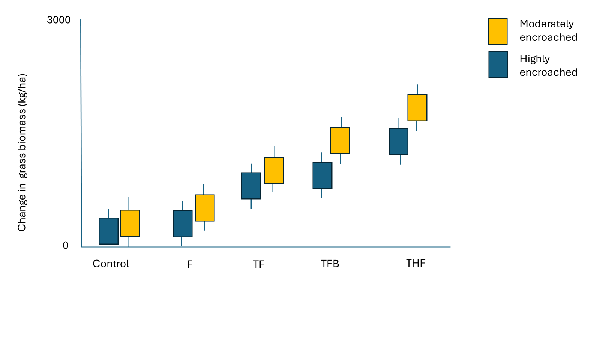
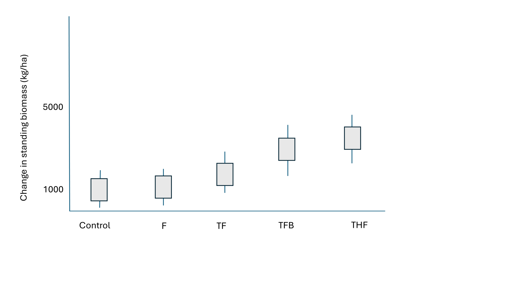
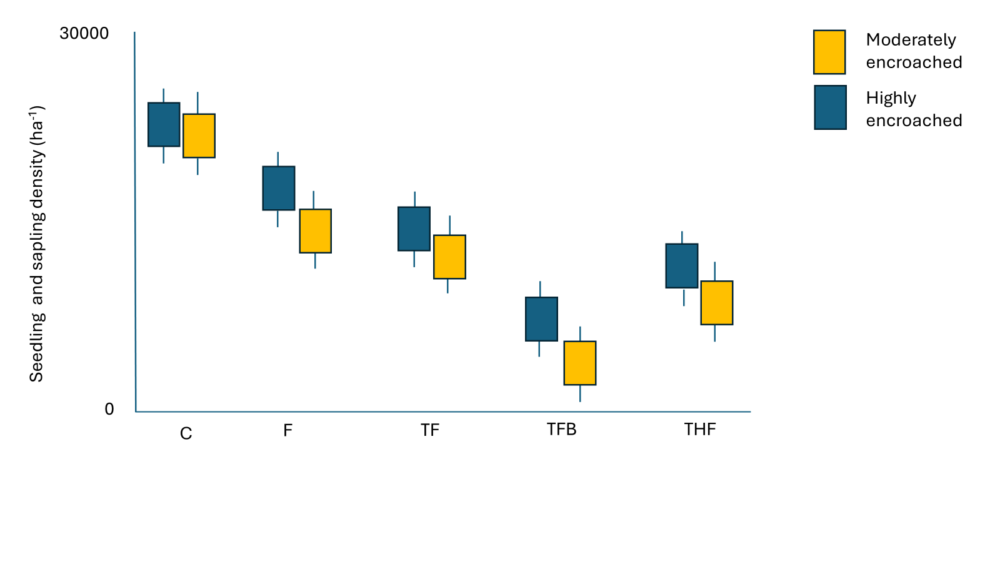
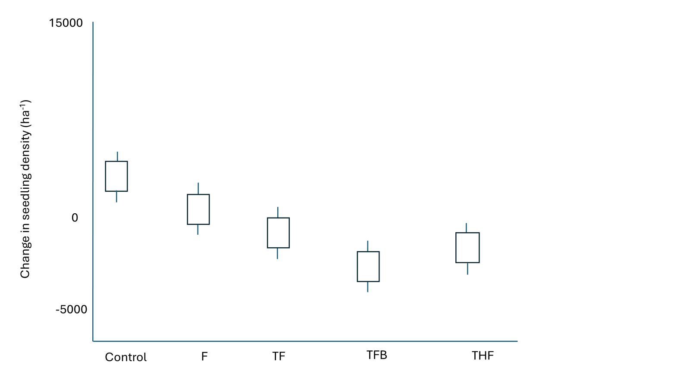
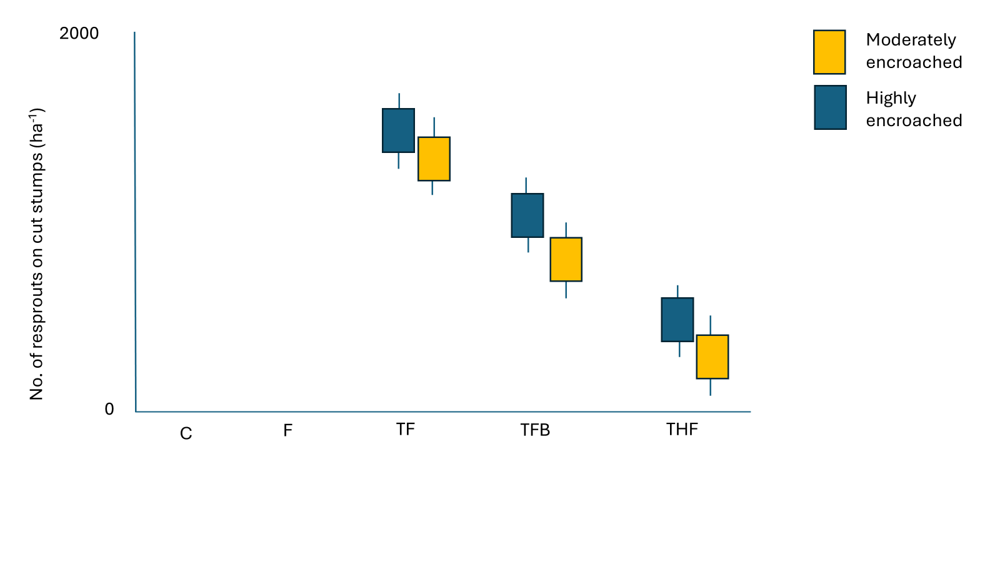
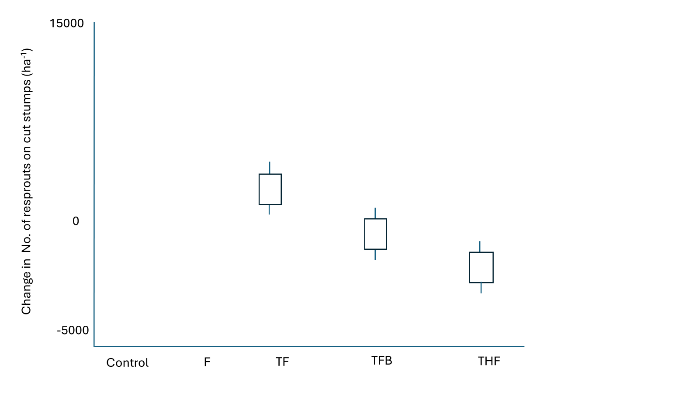

**Title: Managing bush encroachment on a holistically managed rangeland in a semi-arid savanna**

**Research objectives:**   

i\. To determine the efficacy of selected bush encroachment management strategies including woody plant thinning, targeted herbicide application, browsers (goats), and prescribed fire, on seedling density, sapling recruitment, and resprouting dynamics.

ii\. To evaluate the effects of bush encroachment management strategies on above-ground grass biomass, grass species richness, and diversity at encroached sites.

# Agenda for the meeting (06-06-2025)

-   Update on fieldwork

-   Update on repeat prescribed experimental plot burns

-   Update on treatment that involves goats

-   Expected results

-   Preliminary results - Standing grass biomass

# **Insights**

-   Field work complete, all treatments implemented. Data entry done. Oven drying of grass samples ongoing.

-   We got approval from the SHR management to repeat experimental plot burns. Burns scheduled for the 8th - 14th of September 2025.

-   End of April 2025 we implemented the 'browser' treatment. 15 goats per plot for 3hours. Intend to reintroduce 30 goats in November.

# [Expected results]{.underline}



Figure 1. Moderately encroached plots expected to significantly differ with highly encroached plots, although the THF treatment is expected to significantly differ with all treatments.


Figure 2. Standing grass biomass expected to significantly increase in fenced plots under the THF.



Figure 3. TFH will significantly increase above ground grass biomass in both moderately and highly encroached sites.



Figure 4 . TFB will significantly reduce seedling and sapling density across the two encroachment levels.


Figure 5. Across all sites fenced plots will have a significant high number of seedlings and saplings, although the TFB will significantly reduce the density of seedlings and saplings compared to other treatments.



Figure 6. TFB will significantly reduce the density of seedlings and saplings compared to other treatments.



Figure 7. Across all sites, bush encroachment levels the most significant reduction of resprouts on cut stumps will be by the THF treatment in moderately encroached and unfenced plots.


Figure 8. Generally unfenced plots will exhibit a reduction in the number of resprouts on cut stumps. Although the THF treatment is expected to significantly reduce the density of resprouts on cut stumps.



Figure 9. THF will significantly reduce the number of resprouts on cut stumps

```         
```

# Preliminary results

## 1. Standing grass biomass

```{r, warning=FALSE, message=FALSE, fig.cap="Figure 10. Above-ground grass biomass is strongly predicted by DPM height (cm) at Shangani Holistic Ranch. There is a linear relationship ($R^2 = 0.792$)."}

library(tidyverse)
library(lmerTest)
library(ggplot2)
library(dplyr)
library(Matrix)
library(lme4)
library(emmeans)
library(here) ## MOST IMPORTANT NOT TO FORGET THIS ONE
library(robustbase)
library(sjPlot)

theme_beautiful <- function() {
  theme_bw() +
    theme(
      text = element_text(family = "Helvetica"),
      axis.text = element_text(size = 8, color = "black"),
      axis.title = element_text(size = 8, color = "black"),
      axis.line.x = element_line(size = 0.3, color = "black"),
      axis.line.y = element_line(size = 0.3, color = "black"),
      axis.ticks = element_line(size = 0.3, color = "black"),
      panel.border = element_blank(),
      panel.grid.major.x = element_blank(),
      panel.grid.minor.x = element_blank(),
      panel.grid.minor.y = element_blank(),
      panel.grid.major.y = element_blank(),
      plot.margin = unit(c(0.5, 0.5, 0.5, 0.5), units = , "cm"),
      plot.title = element_text(
        size = 8,
        vjust = 1,
        hjust = 0.5,
        color = "black"
      ),
      legend.text = element_text(size = 8, color = "black"),
      legend.title = element_text(size = 8, color = "black"),
      legend.position = c(0.9, 0.9),
      legend.key.size = unit(0.9, "line"),
      legend.background = element_rect(
        color = "black",
        fill = "transparent",
        size = 2,
        linetype = "blank"
      )
    )
}

WGdata <- read_csv(here("DATA/DPM.csv"))

################## DPM HEIGHT ~ OVEN DRIED WEIGHT. NO SQUARE ROOT
# 2. Convert weight from grams to kg/ha
#    Area of 34cm diameter disc = π * (0.17 m)^2 = 0.0908 m²
frame_area <- pi * (0.17^2)  # = 0.0908 m²
WGdata$Biomass_kg_ha <- WGdata$Weight * 10 / frame_area

# 3. Linear regression: Biomass ~ DPH
modelWG <- lm(Biomass_kg_ha ~ DPH_Height, data = WGdata)
#summary(modelWG)
#tab_model(modelWG)

### EQUATION FOR THE MODEL AND ANNOTATION
# Extract coefficients
    coefs <- coef(modelWG)
   intercept <- round(coefs[1], 2)
    slope <- round(coefs[2], 2)
 
 # Create equation string for annotation
 # Build the equation string (biomass = intercept + slope * x)
     eq <- paste0("Biomass== ", intercept, " + ", slope, " %*% Dpm")
 
 # Plot with regression and equation
 ggplot(WGdata, aes(x = DPH_Height, y = Biomass_kg_ha)) +
   geom_point() +
   geom_smooth(method = "lm", se = TRUE, color = "red") +
   annotate("text", x = min(WGdata$DPH_Height, na.rm = TRUE), 
            y = max(WGdata$Biomass_kg_ha, na.rm = TRUE), 
          label = eq, parse = TRUE, hjust = 0, size = 3, color = "red") +
   labs(
     x = "Dpm height (cm)",
     y = "Standing grass biomass (kg/ha)"
   ) +
   theme_beautiful()
 


```

```{r, warning=FALSE, message=FALSE, fig.cap="Figure 11. Comparing the Trollope and Potgieter (1986) model and SHR model using untransformed DPM height"}

library(tidyverse)
library(lmerTest)
library(ggplot2)
library(dplyr)
library(Matrix)
library(lme4)
library(emmeans)
library(here) ## MOST IMPORTANT NOT TO FORGET THIS ONE
library(robustbase)
library(sjPlot)

theme_beautiful <- function() {
  theme_bw() +
    theme(
      text = element_text(family = "Helvetica"),
      axis.text = element_text(size = 8, color = "black"),
      axis.title = element_text(size = 8, color = "black"),
      axis.line.x = element_line(size = 0.3, color = "black"),
      axis.line.y = element_line(size = 0.3, color = "black"),
      axis.ticks = element_line(size = 0.3, color = "black"),
      panel.border = element_blank(),
      panel.grid.major.x = element_blank(),
      panel.grid.minor.x = element_blank(),
      panel.grid.minor.y = element_blank(),
      panel.grid.major.y = element_blank(),
      plot.margin = unit(c(0.5, 0.5, 0.5, 0.5), units = , "cm"),
      plot.title = element_text(
        size = 8,
        vjust = 1,
        hjust = 0.5,
        color = "black"
      ),
      legend.text = element_text(size = 8, color = "black"),
      legend.title = element_text(size = 8, color = "black"),
      legend.position = c(0.9, 0.9),
      legend.key.size = unit(0.9, "line"),
      legend.background = element_rect(
        color = "black",
        fill = "transparent",
        size = 2,
        linetype = "blank"
      )
    )
}

######################## COMPARE EQUATIONS FOR UNTRANSFORMED DPM HEIGHTS #####

UGdata <- read_csv(here("DATA/DPM.csv"))
# 2. Convert weight from grams to kg/ha
#    Area of 34cm diameter disc = π * (0.17 m)^2 = 0.0908 m²
frame_area <- pi * (0.17^2)  # = 0.0908 m²
UGdata$Biomass_kg_ha <- UGdata$Weight * 10 / frame_area

# # Step 2: Add WG Data and TR Model as long-format data
UG_actual_data <- data.frame(
  DPH_Height = UGdata$DPH_Height,
  Biomass_kg_ha = UGdata$Biomass_kg_ha,
  Source = "SHR",
  stringsAsFactors = FALSE)


# # Step 3: Create TR model data using sqrt(DPH)
TR_model_data <- data.frame(
  DPH_Height = UGdata$DPH_Height,
  Biomass_kg_ha = -3019 + 2260 * sqrt(UGdata$DPH_Height),
  Source = "Trollope and Potgieter 1986",
  stringsAsFactors = FALSE)


## Step 4: Fit SHR model
model_shr <- lm(Biomass_kg_ha ~ DPH_Height, data = UG_actual_data)
coefs_shr <- round(coef(model_shr), 2)
eq_shr <- paste0("Biomass == ", coefs_shr[1], " + ", coefs_shr[2], " %*% DPM")

# Step 5: Trollope equation (fixed known values)
eq_trollope <- "Biomass == -3019 + 2260 * sqrt(DPM)"

## Step : Combine datasets
combined <- rbind(UG_actual_data, TR_model_data)

# Step 6: Plot
ggplot(combined, aes(x = DPH_Height, y = Biomass_kg_ha, color = Source)) +
  geom_point(data = subset(combined, Source == "SHR"), size = 2) +
  geom_smooth(data = subset(combined, Source == "SHR"),
              method = "lm", se = FALSE) +
  geom_line(data = subset(combined, Source == "Trollope and Potgieter 1986"),
            linetype = "dashed", size = 1) +
  annotate("text", x = 50, y = 4000, label = eq_shr, parse = TRUE, color = "red", size = 4) +
  annotate("text", x = 50, y = 3000, label = eq_trollope, parse = TRUE, color = "lightblue", size = 4) +
  labs(
    x = "DPM height (cm)",
    y = "Standing grass biomass (kg/ha)",
    color = "Model"
  ) + theme_beautiful() + 
  theme(
   legend.position = c(0.1, 1),
  legend.justification = c(0, 1),
  legend.box.just = "left",
  legend.title = element_text(face = "bold"),
  legend.background = element_rect(fill = "white", color = "gray90"))
```

```{r, warning=FALSE, message=FALSE, fig.cap="Figure 12. Comparing DPM height across sites."}

library(tidyverse)
library(lmerTest)
library(ggplot2)
library(dplyr)
library(Matrix)
library(lme4)
library(emmeans)
library(here) ## MOST IMPORTANT NOT TO FORGET THIS ONE
library(robustbase)
library(sjPlot)

theme_beautiful <- function() {
  theme_bw() +
    theme(
      text = element_text(family = "Helvetica"),
      axis.text = element_text(size = 8, color = "black"),
      axis.title = element_text(size = 8, color = "black"),
      axis.line.x = element_line(size = 0.3, color = "black"),
      axis.line.y = element_line(size = 0.3, color = "black"),
      axis.ticks = element_line(size = 0.3, color = "black"),
      panel.border = element_blank(),
      panel.grid.major.x = element_blank(),
      panel.grid.minor.x = element_blank(),
      panel.grid.minor.y = element_blank(),
      panel.grid.major.y = element_blank(),
      plot.margin = unit(c(0.5, 0.5, 0.5, 0.5), units = , "cm"),
      plot.title = element_text(
        size = 8,
        vjust = 1,
        hjust = 0.5,
        color = "black"
      ),
      legend.text = element_text(size = 8, color = "black"),
      legend.title = element_text(size = 8, color = "black"),
      legend.position = c(0.9, 0.9),
      legend.key.size = unit(0.9, "line"),
      legend.background = element_rect(
        color = "black",
        fill = "transparent",
        size = 2,
        linetype = "blank"
      )
    )
}


################# GRASS BIOMASS
 
 GrassH <- read_csv(here("DATA/March2025/Grasses25.csv"))
  
 Grass_H <- GrassH %>%
   mutate(Site = as.factor(Site),
          Plot = as.factor(Plot),
          Subplot = as.factor(Subplot),
          Height = as.numeric(DPM_Height))
 
 # Summarize height statistics by Site, Plot, and Subplot
 Gheight_summary <- Grass_H %>%
   group_by(Site, Plot) %>%
   summarize(
     Mean_Height = mean(DPM_Height, na.rm = TRUE),
     Median_Height = median(DPM_Height, na.rm = TRUE),
     Min_Height = min(DPM_Height, na.rm = TRUE),
     Max_Height = max(DPM_Height, na.rm = TRUE),
     .groups = "drop")
 

 
 ###violin plot
 ggplot(Grass_H, aes(x = interaction(Site), y = DPM_Height)) +
   geom_violin(fill = "lightblue", color = "darkblue") +
   labs(
     x = "Site",
     y = "DPM height (cm)"
   ) +
   theme_beautiful() 

 
```

```{r, warning=FALSE, message=FALSE, fig.cap="Figure 13. Comparing DPM height across treatments reveals that the treatment groups do not differ significantly in their effect on the DPM height at SHR."}

Grdata <- read_csv(here("DATA/March2025/GrassesCombined.csv"))
 
 # Standardize column names
 names(Grdata) <- tolower(names(Grdata))
 # Rename all column names to lowercase and replace spaces with underscores
 names(Grdata) <- gsub(" ", "_", tolower(names(Grdata)))
 
 
 # Clean and format, FILTERING NAs
 
 Grdata <- Grdata %>%
   filter(!is.na(dpm_height)) %>%  # Exclude NAs in dpm_height
   mutate(
     year = as.factor(year),
     site = as.factor(site),
     plot = as.factor(plot),
     subplot = as.factor(subplot),
     treatment = as.factor(treatment),
     dpm_height = as.numeric(dpm_height) # Ensure numeric
   )
 
 # Check missing values
 #summary(Grdata$dpm_height)
 
 ###2. Create Pre/Post Variable
 
 Grdata <- Grdata %>%
   mutate(period = ifelse(as.numeric(as.character(year)) < 2025, "PRE", "POST")) %>%
   mutate(period = factor(period, levels = c("PRE", "POST")))
 
 ### Summarize by Subplot or Plot..Average height per subplot and period:
 
 summary_Grdata <- Grdata %>%
   group_by(site, plot, subplot, treatment, period) %>%
   summarise(mean_height = mean(dpm_height, na.rm = TRUE)) %>%
   ungroup()
 
 ####4. Calculate Change in Height (Post - Pre)
 height_change <- summary_Grdata %>%
   pivot_wider(names_from = period, values_from = mean_height) %>%
   mutate(delta = POST - PRE)
 
 ### Compare Treatment Effects (ANOVA on Delta)
# anova_model <- aov(delta ~ treatment, data = height_change)
# summary(anova_model)
 # the results show that the treatment groups do not differ significantly in their effect on the response variable.
 
 ## Optional: Tukey post-hoc test
# TukeyHSD(anova_model)
 
 
 ## USE OF Mixed-Effects Model (Handles Repeated Measures)
 #This is more robust as it uses the original data, accounts for plot/subplot as random effects, and tests interaction between time and treatment:
 
# lmm <- lmer(dpm_height ~ period * treatment + (1 | site/plot/subplot), data = Grdata)
 #summary(lmm)
 # Look at the interaction terms (periodPOST:treatmentX) to assess whether any treatment caused a significant change post-treatment.
 
 
 #Filtering NAs only when modeling Height
 
 model <- lmer(dpm_height ~ period * treatment + (1 | site/plot/subplot),
               data = Grdata[!is.na(Grdata$dpm_height), ])
 
 
 
 ##Plotting boxplot for before and after treatment
 #ggplot(Grdata[!is.na(Grdata$dpm_height), ],
  #      aes(x = treatment, y = dpm_height, fill = period)) +
   #geom_boxplot() +
   #theme_beautiful()
 
 ### Violin plot
 ### Violin plot
 ggplot(Grdata[!is.na(Grdata$dpm_height), ],
        aes(x = treatment, y = dpm_height, fill = period)) +
   geom_violin(trim = FALSE) +
   labs(y = "Dpm height (cm)", x = "Treatments") +
   theme_beautiful()
 
```
