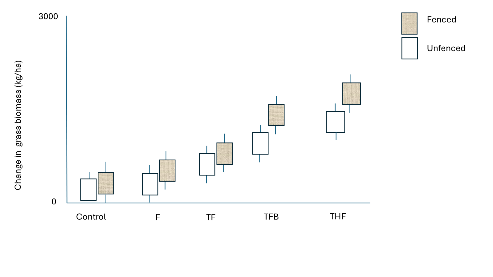
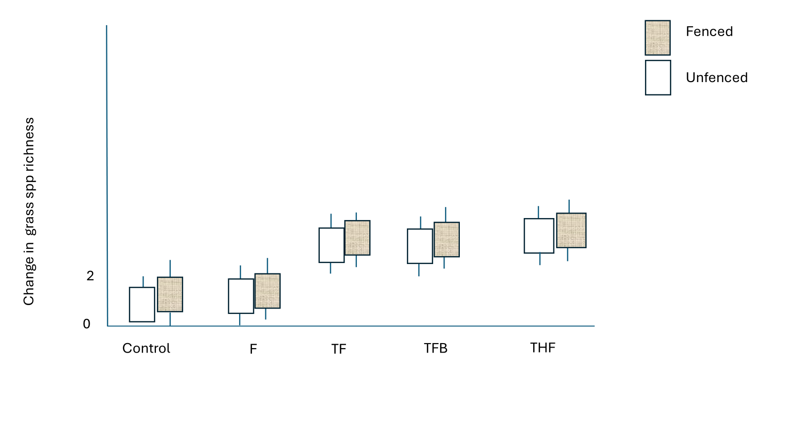
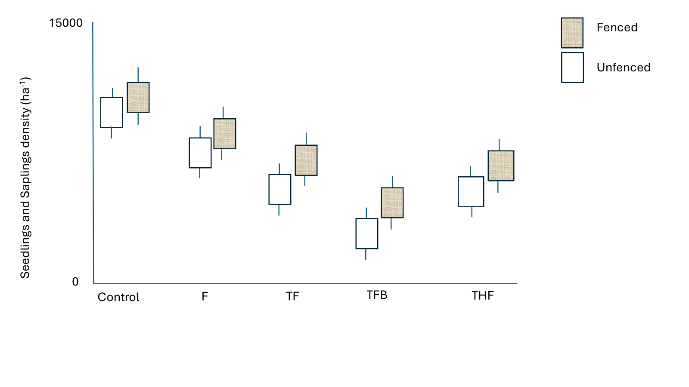
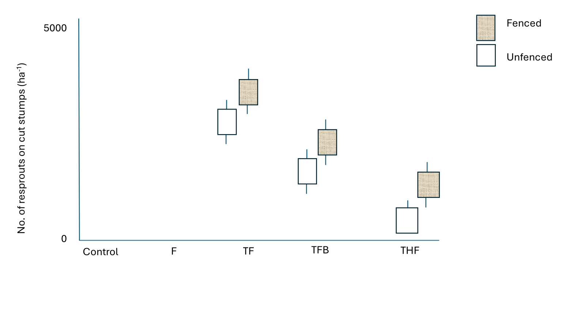
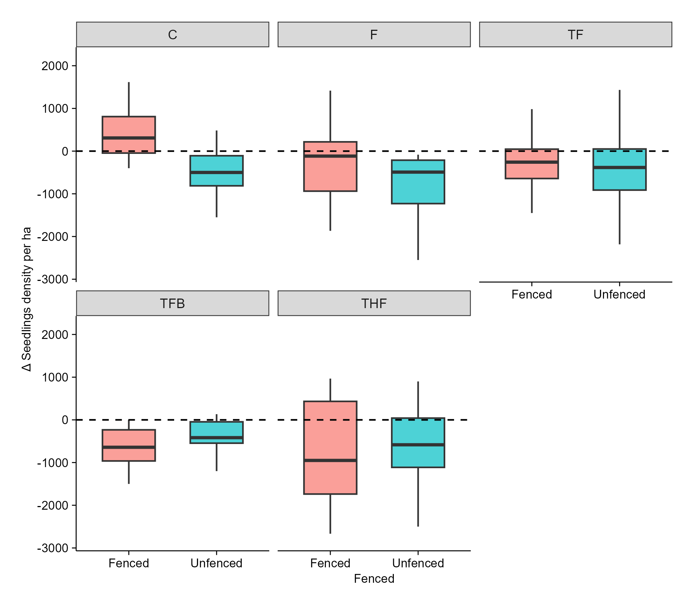
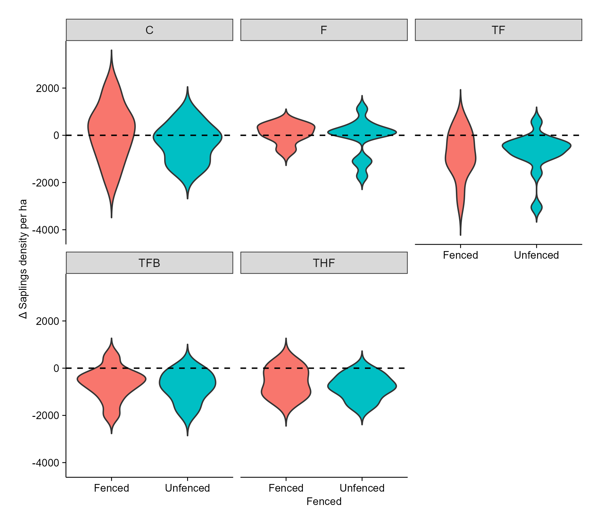
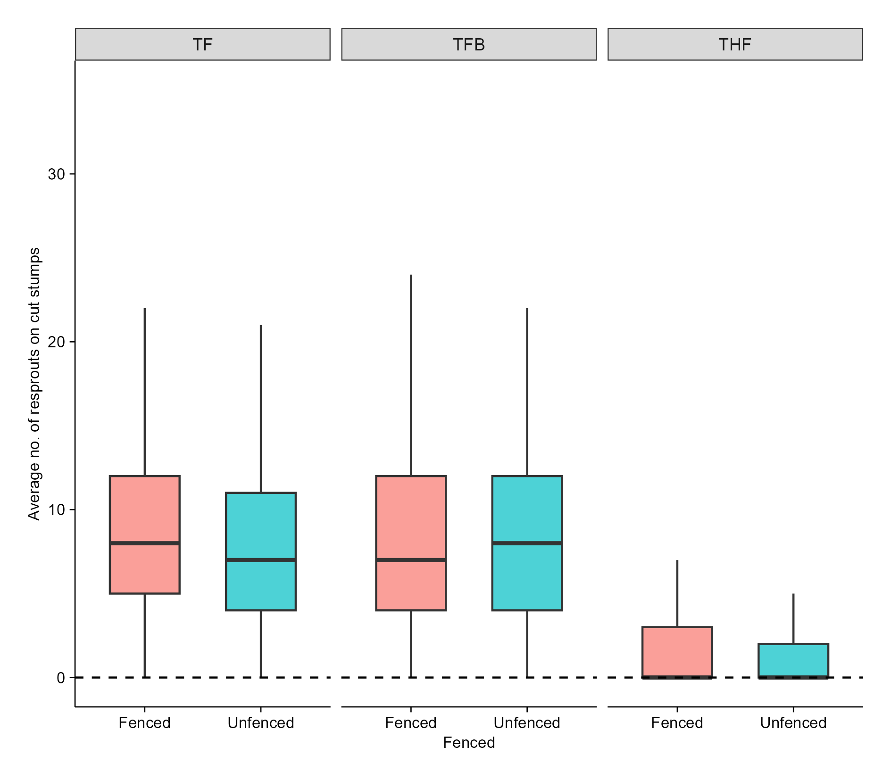

**Title: Managing bush encroachment on a holistically managed rangeland in a semi-arid savanna**

**Research objectives:**   

i\. To determine the efficacy of selected bush encroachment management strategies including woody plant thinning, targeted herbicide application, browsers (goats), and prescribed fire, on seedling density, sapling recruitment, and resprouting dynamics.

ii\. To evaluate the effects of bush encroachment management strategies on above-ground grass biomass, grass species richness, and diversity at encroached sites.

# Agenda for the meeting (04-07-2025)

-   Updated on Expected results

-   Preliminary results - Standing grass biomass, grass height, species richness, seedlings density, saplings density, resprouts population on cut stumps.

# **Updates**

-   Completed level 1 LTHE course

-   Completed level 1 REC outdoor training

# [Expected results]{.underline}



Figure 1. Standing grass biomass is expected to significantly increase in fenced plots under the THF treatment.

Thinning and burning in moderately encroached areas can increase grass biomass by reducing woody plant competition for resources like light, water, and nutrients (Ludwig et al., 2004), and by releasing nutrients into the soil (Huntley, 2023). This allows grasses to access more resources, photosynthesise effectively, and enhance above-ground biomass production. Applying herbicides to cut stumps can prevent resprouting (Monegi et al., 2023), this reduction in resprouts allows for increased grass production by lowering competition for light, moisture, and space, which in turn enhances photosynthesis and encourages grass tillering. Fire eliminates fire-sensitive woody plants and stimulates new grass growth (Huntley, 2023). Fencing the plots excludes herbivores and enables grasses to recover from grazing and fire, further promoting their growth and biomass production (Kesch et al.,2019).



Figure 2. Grass species richness expected to significantly increase in all treatments that involve thinning.

Fencing provides a layer of physical protection for grasses against external disturbances by preventing trampling and grazing. This safeguarding allows the grasses ample time to reproduce, ultimately leading to enhanced grass biomass (Deng et al., 2014). Additionally, thinning promotes an increase in grass biomass by improving light penetration and water availability for the grasses (Ludwig et al., 2004).

.



Figure 3. Across all sites fenced plots will have a significant high number of seedlings and saplings, although the TFB will significantly reduce the density of seedlings and saplings compared to other treatments.

The combined effects of thinning, fire, and browsing result in a significant reduction in seedling and sapling density. Thinning can increase grass competition (Hare et al., 2021), which in turn competes with seedlings for essential resources, leading to reduced photosynthetic activity and increased mortality among young woody plants. Furthermore, thinning exposes seedlings and saplings to browsers and fire, resulting in high mortality rates (Albrecht & McCarthy, 2006). Fire can directly destroy small woody plants, disrupt seedling establishment conditions, and facilitate follow-up herbivory, while browsers (e.g. goats) target tender shoots, leaves, and growing tips of seedlings and saplings (Elias & Tischew, 2016), depleting their starch reserves (Schutz et al., 2011). The loss of apical meristems stunts vertical growth, reduces leaf area, and interrupts photosynthetic activity. This greatly weakens and increases the susceptibility of young plants to stressors, ultimately leading to reduced photosynthetic activity and increased mortality (Staver et al., 2009) thus, browsers act as a filter for young woody plants (Archibald et al., 2021). The cumulative impact of these factors will be more pronounced in unfenced plots, where accessibility by wild animals and livestock exacerbates the negative effects on seedling and sapling density.



Figure 4. Generally unfenced plots will exhibit a reduction in the number of resprouts on cut stumps. Although the THF treatment is expected to significantly reduce the density of resprouts on cut stumps.

The strategic combination of thinning, herbicide, and fire (THF) treatments effectively suppresses the resprouting of woody plants. Applying herbicide to cut stumps kills the regenerative tissues, which prevents or severely limits the plant's ability to produce new growth from the base or roots (Stritzke et al., 1991). Following this, prescribed fire further reduces resprouting by directly killing emerging shoots and imposing heat stress on the woody plants (Huntley, 2023). The cumulative effect of these combined stressors exhausts the plant's energy reserves, leading to a significant reduction in resprouting. Additionally, unfenced plots can have the lowest number of resprouts because herbivores constantly browse and trample woody plants, hindering their recovery, depleting their energy reserves (Schutz et al., 2011), and increasing stump mortality.

```         
```

# Preliminary results

## 1. Standing grass biomass

```{}
```

```{r, warning=FALSE, message=FALSE, fig.cap="Figure 5.Comparing SHR model with the fitted intercept line passing through origin"}

library(tidyverse)
library(lmerTest)
library(ggplot2)
library(dplyr)
library(Matrix)
library(lme4)
library(emmeans)
library(here) ## MOST IMPORTANT NOT TO FORGET THIS ONE
library(robustbase)
library(sjPlot)

theme_beautiful <- function() {
  theme_bw() +
    theme(
      text = element_text(family = "Helvetica"),
      axis.text = element_text(size = 8, color = "black"),
      axis.title = element_text(size = 8, color = "black"),
      axis.line.x = element_line(size = 0.3, color = "black"),
      axis.line.y = element_line(size = 0.3, color = "black"),
      axis.ticks = element_line(size = 0.3, color = "black"),
      panel.border = element_blank(),
      panel.grid.major.x = element_blank(),
      panel.grid.minor.x = element_blank(),
      panel.grid.minor.y = element_blank(),
      panel.grid.major.y = element_blank(),
      plot.margin = unit(c(0.5, 0.5, 0.5, 0.5), units = , "cm"),
      plot.title = element_text(
        size = 8,
        vjust = 1,
        hjust = 0.5,
        color = "black"
      ),
      legend.text = element_text(size = 8, color = "black"),
      legend.title = element_text(size = 8, color = "black"),
      legend.position = c(0.9, 0.9),
      legend.key.size = unit(0.9, "line"),
      legend.background = element_rect(
        color = "black",
        fill = "transparent",
        size = 2,
        linetype = "blank"
      )
    )
}
WGdata <- read_csv(here("DATA/DPM.csv"))


################## DPM HEIGHT ~ OVEN DRIED WEIGHT. NO SQUARE ROOT
# 2. Convert weight from grams to kg/ha
#    Area of 34cm diameter disc = π * (0.17 m)^2 = 0.0908 m²
frame_area <- pi * (0.17^2)  # = 0.0908 m²
WGdata$Biomass_kg_ha <- WGdata$Weight * 10 / frame_area


 # 3. Linear regression: Biomass ~ DPH
modelWG <- lm(Biomass_kg_ha ~ DPH_Height, data = WGdata)

modelWG0 <- lm(Biomass_kg_ha ~ 0 + DPH_Height, data = WGdata)   # intercept = 0

#summary(modelWG)
# tab_model(modelWG)

 ###adding annotation to the plot
 
 # Extract coefficients
    coefs <- coef(modelWG)
   intercept <- round(coefs[1], 2)
    slope <- round(coefs[2], 2)
 
 # Create equation string for annotation
 # Build the equation string (biomass = intercept + slope * x)
    eq <- paste0("Biomass== ", intercept, " + ", slope, " %*% Dpm")
    
    coef <- coefficients(modelWG)
    r2 <- summary(modelWG)$r.squared
    n <- nobs(modelWG)
    eq <- paste0(
      "y = ", round(coef[1], 2), " + ", round(coef[2], 2), "x\n",
      "R² = ", round(r2, 3), ", n = ", n)
    
##2 -- zero‑intercept line (parallel construction) --
coef0 <- coefficients(modelWG0)                # only the slope
r2_0  <- summary(modelWG0)$r.squared
eq0   <- paste0(
  "y = ", round(coef0[1], 2), "x\n",
  "R² = ", round(r2_0, 3), ", n = ", n)
    
##Using same data to fit INTERCEPT PASSING THROUGH ORIGIN   
  
  
ggplot(WGdata, aes(x = DPH_Height, y = Biomass_kg_ha))+
     geom_point()+
     geom_smooth(method = "lm", se = TRUE, color = "red")+
geom_smooth(method = "lm", formula = y ~ x - 1, colour = "blue") + # zero‑intercept
  annotate("text",
           x = min(WGdata$DPH_Height, na.rm = TRUE),
           y = max(WGdata$Biomass_kg_ha, na.rm = TRUE),
           label = eq,   hjust = 0, size = 3, colour = "red") +
  annotate("text",
           x = min(WGdata$DPH_Height, na.rm = TRUE),
           y = 0.90 * max(WGdata$Biomass_kg_ha, na.rm = TRUE),            
           label = eq0,  hjust = 0, size = 3, colour = "blue") +
  labs(x = "DPM Height (cm)",
       y = "Standing grass biomass (kg/ha)") +
  theme_beautiful()

```

```{r, warning = FALSE, message=FALSE, fig.cap="Figure 6. Log transformed variables show a linear relationship between transformed DPM height (cm) and standing grass biomass (kg/ha) at SHR."}


library(tidyverse)
library(lmerTest)
library(ggplot2)
library(dplyr)
library(Matrix)
library(lme4)
library(emmeans)
library(here) ## MOST IMPORTANT NOT TO FORGET THIS ONE
library(robustbase)
library(sjPlot)

theme_beautiful <- function() {
  theme_bw() +
    theme(
      text = element_text(family = "Helvetica"),
      axis.text = element_text(size = 8, color = "black"),
      axis.title = element_text(size = 8, color = "black"),
      axis.line.x = element_line(size = 0.3, color = "black"),
      axis.line.y = element_line(size = 0.3, color = "black"),
      axis.ticks = element_line(size = 0.3, color = "black"),
      panel.border = element_blank(),
      panel.grid.major.x = element_blank(),
      panel.grid.minor.x = element_blank(),
      panel.grid.minor.y = element_blank(),
      panel.grid.major.y = element_blank(),
      plot.margin = unit(c(0.5, 0.5, 0.5, 0.5), units = , "cm"),
      plot.title = element_text(
        size = 8,
        vjust = 1,
        hjust = 0.5,
        color = "black"
      ),
      legend.text = element_text(size = 8, color = "black"),
      legend.title = element_text(size = 8, color = "black"),
      legend.position = c(0.9, 0.9),
      legend.key.size = unit(0.9, "line"),
      legend.background = element_rect(
        color = "black",
        fill = "transparent",
        size = 2,
        linetype = "blank"
      )
    )
}

WGdata <- read_csv(here("DATA/DPM.csv"))

################## DPM HEIGHT ~ OVEN DRIED WEIGHT. NO SQUARE ROOT
# 2. Convert weight from grams to kg/ha
#    Area of 34cm diameter disc = π * (0.17 m)^2 = 0.0908 m²
frame_area <- pi * (0.17^2)  # = 0.0908 m²
WGdata$Biomass_kg_ha <- WGdata$Weight * 10 / frame_area

   #LOG TRANSFORMING BOTH VARIABLE
    #Log-transform both variables (natural log)
     WGdata$log_Biomass_kg_ha <- log(WGdata$Biomass_kg_ha)
     WGdata$log_DPH_Height <- log(WGdata$DPH_Height)

  # Fit a linear model using log-transformed variables
    modelG <- lm(log_Biomass_kg_ha ~ log_DPH_Height, data = WGdata)
    #tab_model(modelG)
    
    # Extract coefficients
    coefs <- coef(modelG)
    intercept <- round(coefs[1], 2)
    slope <- round(coefs[2], 2)
    
   # Create equation string for annotation
    # Build the equation string (biomass = intercept + slope * x)
    eq1 <- paste0("Biomass== ", intercept, " + ", slope, " %*% Dpm")
    
    coef <- coefficients(modelG)
    r2 <- summary(modelG)$r.squared
    n <- nobs(modelG)
    eq1 <- paste0(
      "y = ", round(coef[1], 2), " + ", round(coef[2], 2), "x\n",
      "R² = ", round(r2, 3), ", n = ", n)
    
    

  ## Plot log-log regression
    ggplot(WGdata, aes(y = log_Biomass_kg_ha, x = log_DPH_Height)) +
      geom_point() +
      geom_smooth(method = "lm", se = FALSE, color = "red") +
      annotate("text", x = Inf, y = -Inf, label = eq1, hjust = 1.1, vjust = -0.5, size = 4, color = "black") +
      labs( x = "Log Dpm height (cm)",
            y = "Log Standing grass biomass (kg/ha)"
      ) +
      theme_beautiful()
    


  
```

```{r, warning=FALSE, message=FALSE, fig.cap="Figure 7. Square root transformed variables show a linear relationship between transformed DPM height (cm) and standing grass biomass (kg/ha) at SHR."}

library(tidyverse)
library(lmerTest)
library(ggplot2)
library(dplyr)
library(Matrix)
library(lme4)
library(emmeans)
library(here) ## MOST IMPORTANT NOT TO FORGET THIS ONE
library(robustbase)
library(sjPlot)

theme_beautiful <- function() {
  theme_bw() +
    theme(
      text = element_text(family = "Helvetica"),
      axis.text = element_text(size = 8, color = "black"),
      axis.title = element_text(size = 8, color = "black"),
      axis.line.x = element_line(size = 0.3, color = "black"),
      axis.line.y = element_line(size = 0.3, color = "black"),
      axis.ticks = element_line(size = 0.3, color = "black"),
      panel.border = element_blank(),
      panel.grid.major.x = element_blank(),
      panel.grid.minor.x = element_blank(),
      panel.grid.minor.y = element_blank(),
      panel.grid.major.y = element_blank(),
      plot.margin = unit(c(0.5, 0.5, 0.5, 0.5), units = , "cm"),
      plot.title = element_text(
        size = 8,
        vjust = 1,
        hjust = 0.5,
        color = "black"
      ),
      legend.text = element_text(size = 8, color = "black"),
      legend.title = element_text(size = 8, color = "black"),
      legend.position = c(0.9, 0.9),
      legend.key.size = unit(0.9, "line"),
      legend.background = element_rect(
        color = "black",
        fill = "transparent",
        size = 2,
        linetype = "blank"
      )
    )
}

SQGdata <- read_csv(here("DATA/DPM.csv"))

################## DPM HEIGHT ~ OVEN DRIED WEIGHT. NO SQUARE ROOT
# 2. Convert weight from grams to kg/ha
#    Area of 34cm diameter disc = π * (0.17 m)^2 = 0.0908 m²
frame_area <- pi * (0.17^2)  # = 0.0908 m²
SQGdata$Biomass_kg_ha <- SQGdata$Weight * 10 / frame_area

   #LOG TRANSFORMING BOTH VARIABLE
    #Log-transform both variables (natural log)
     SQGdata$sqrt_Biomass_kg_ha <- sqrt(SQGdata$Biomass_kg_ha)
     SQGdata$sqrt_DPH_Height <- sqrt(SQGdata$DPH_Height)

  # Fit a linear model using log-transformed variables
    modelSG <- lm(sqrt_Biomass_kg_ha ~ sqrt_DPH_Height, data = SQGdata)
    #tab_model(modelSG)
    
    # Extract coefficients
    coefs <- coef(modelSG)
    intercept <- round(coefs[1], 2)
    slope <- round(coefs[2], 2)
    
   # Create equation string for annotation
    # Build the equation string (biomass = intercept + slope * x)
    eq1 <- paste0("Biomass== ", intercept, " + ", slope, " %*% Dpm")
    
    coef <- coefficients(modelSG)
    r2 <- summary(modelSG)$r.squared
    n <- nobs(modelSG)
    eq1 <- paste0(
      "y = ", round(coef[1], 2), " + ", round(coef[2], 2), "x\n",
      "R² = ", round(r2, 3), ", n = ", n)
    
    

  ## Plot log-log regression
    ggplot(SQGdata, aes(y = sqrt_Biomass_kg_ha, x = sqrt_DPH_Height)) +
      geom_point() +
      geom_smooth(method = "lm", se = FALSE, color = "red") +
      annotate("text", x = Inf, y = -Inf, label = eq1, hjust = 1.1, vjust = -0.5, size = 4, color = "black") +
      labs( x = "sqrt Dpm height (cm)",
            y = "sqrt Standing grass biomass (kg/ha)"
      ) +
      theme_beautiful()
```

```{r, warning=FALSE, message=FALSE, fig.cap="Figure 8. Comparing DPM height across treatments reveals that the treatment groups do not differ significantly in their effect on the DPM height at SHR."}

Grdata <- read_csv(here("DATA/March2025/GrassesCombined.csv"))
 
 # Standardize column names
 names(Grdata) <- tolower(names(Grdata))
 # Rename all column names to lowercase and replace spaces with underscores
 names(Grdata) <- gsub(" ", "_", tolower(names(Grdata)))
 
 
 # Clean and format, FILTERING NAs
 
 Grdata <- Grdata %>%
   filter(!is.na(dpm_height)) %>%  # Exclude NAs in dpm_height
   mutate(
     year = as.factor(year),
     site = as.factor(site),
     plot = as.factor(plot),
     subplot = as.factor(subplot),
     treatment = as.factor(treatment),
     dpm_height = as.numeric(dpm_height) # Ensure numeric
   )
 
 # Check missing values
 #summary(Grdata$dpm_height)
 
 ###2. Create Pre/Post Variable
 
 Grdata <- Grdata %>%
   mutate(period = ifelse(as.numeric(as.character(year)) < 2025, "PRE", "POST")) %>%
   mutate(period = factor(period, levels = c("PRE", "POST")))
 
 ### Summarize by Subplot or Plot..Average height per subplot and period:
 
 summary_Grdata <- Grdata %>%
   group_by(site, plot, subplot, treatment, period) %>%
   summarise(mean_height = mean(dpm_height, na.rm = TRUE)) %>%
   ungroup()
 
 ####4. Calculate Change in Height (Post - Pre)
 height_change <- summary_Grdata %>%
   pivot_wider(names_from = period, values_from = mean_height) %>%
   mutate(delta = POST - PRE)
 
 ### Compare Treatment Effects (ANOVA on Delta)
# anova_model <- aov(delta ~ treatment, data = height_change)
# summary(anova_model)
 # the results show that the treatment groups do not differ significantly in their effect on the response variable.
 
 ## Optional: Tukey post-hoc test
# TukeyHSD(anova_model)
 
 
 ## USE OF Mixed-Effects Model (Handles Repeated Measures)
 #This is more robust as it uses the original data, accounts for plot/subplot as random effects, and tests interaction between time and treatment:
 
# lmm <- lmer(dpm_height ~ period * treatment + (1 | site/plot/subplot), data = Grdata)
 #summary(lmm)
 # Look at the interaction terms (periodPOST:treatmentX) to assess whether any treatment caused a significant change post-treatment.
 
 
 #Filtering NAs only when modeling Height
 
 model <- lmer(dpm_height ~ period * treatment + (1 | site/plot/subplot),
               data = Grdata[!is.na(Grdata$dpm_height), ])
 
 
 
 ##Plotting boxplot for before and after treatment
 #ggplot(Grdata[!is.na(Grdata$dpm_height), ],
  #      aes(x = treatment, y = dpm_height, fill = period)) +
   #geom_boxplot() +
   #theme_beautiful()
 
 ### Violin plot
 ### Violin plot
 ggplot(Grdata[!is.na(Grdata$dpm_height), ],
        aes(x = treatment, y = dpm_height, fill = period)) +
   geom_violin(trim = FALSE) +
   labs(y = "Dpm height (cm)", x = "Treatments") +
   theme_beautiful()
 
```

```{r, warning=FALSE, message=FALSE, fig.cap="Figure 9. Across all treatments grass DPM height (cm) in fenced plots were on average 0.84 taller than those in unfenced plots (p < 0.001), indicating a strong overall effect of fencing on grass height at SHR."}

library(tidyverse)
library(vegan)
library(multcompView)
library(patchwork)
library(lmerTest)
library(ggplot2)
library(dplyr)
library(Matrix)
library(lme4)
library(emmeans)
library(here) ## MOST IMPORTANT NOT TO FORGET THIS ONE
library(robustbase)
library(sjPlot)
library(flextable)
library(officer)
library(glmmTMB)
library(performance)  # mod


Grassnew <- read_csv(here("DATA/March2025/GrassesCombinedCleaned.csv"))

summary_Gr <- Grassnew %>%
  filter(!is.na(DPM_Height),
         Year %in% c(2024, 2025)) %>% 
group_by(Site, Plot, Subplot, Treatment, Fencing, Year) %>%
  summarise(mean_DPM_Height = mean(DPM_Height, na.rm = TRUE)) %>%
  ungroup() 

#Gr1 <- lmer(DPM_Height ~ Treatment * Fencing + (1 | Site),# random intercepts 
        #    data = Grassnew, REML = FALSE   # use ML for comparing models
           #  )
### marginal means of fencing, averaging over Treatment and Year
 #Gemm_fence <- emmeans(Gr1, ~ Fencing)     # or add , weights = "equal" if you 

#prefer equal‑sized cells
  #Gemm_fence                                  # shows the two means

# test the difference
#contrast(Gemm_fence, method = "revpairwise") # Fenced – Unfenced


###  Fencing effect within each treatment ; Testing effect of fencing on each treatment compared to control
 #Gemm_tf <- emmeans(Gr1, ~ Fencing | Treatment)   # fencing means conditioned on each treatment
 #pairs(Gemm_tf, adjust = "sidak")                # or "none", "bonferroni", "tukey", …

# Visualisation

ggplot(Grassnew, aes(x = Fencing, y = DPM_Height, fill = Fencing)) + facet_wrap(~Treatment)+
  geom_boxplot(alpha = 0.7, outlier.shape = NA, width = 0.6) +
  #geom_jitter(width = 0.15, size = 1.5, alpha = 0.8) +
  geom_hline(yintercept = 0, linetype = "dashed") +
  labs(x = "Treatment", y = " Grass DPM height (cm)") +
  theme_beautiful() +
  theme(legend.position = "none")


```

**Interpretation**

-   All four treatments (F, TF, TFB, THF) increase grass DPM height (cm) relative to the Control treatment when fencing is in place.

-   Leaving plots unfenced reduces grass DPM height (cm), but the effect is highly significant for TF (\< 0.001) and marginally for other treatments.

-   For the Control treatment, fencing the plots did not have an effect on grass DPM height (cm).

```{r, warning=FALSE, message=FALSE, fig.cap="Figure 10. Reveal that there is no statistical evidence that various treatments have an effect on Grass species richness at SHR."}

library(tidyverse)
library(vegan)
library(multcompView)
library(patchwork)
library(lmerTest)
library(ggplot2)
library(dplyr)
library(Matrix)
library(lme4)
library(emmeans)
library(here) ## MOST IMPORTANT NOT TO FORGET THIS ONE
library(robustbase)
library(sjPlot)
library(flextable)
library(officer)
library(glmmTMB)
library(performance)  # mod

GrassComp <- read_csv(here("DATA/March2025/GrassesCombinedCleaned.csv"))

# 1. Prepare data: richness per Site x Treatment x Year
 
 Grass_year <- GrassComp %>% 
  filter(!is.na(Species_name), 
         Year %in% c(2024, 2025)) %>% 
  group_by(Site, Plot, Subplot, Treatment, Year) %>% 
  summarise(spp_richness = n_distinct(Species_name), .groups = "drop")

# Quick look
 #summary(Grass_year)


#######  Δ‑change (2025 – 2024) analysis --------------------------------------
# Pivot wider to compute site‑level change

grass_delta <- Grass_year %>%
  pivot_wider(names_from = Year, values_from = spp_richness, names_prefix = "Y") %>%
  mutate(delta = Y2025 - Y2024)

# Fit linear mixed model for delta (can go negative, so Gaussian assumption)
    gmod_delta <- lmer(delta ~ Treatment + (1|Site), data = grass_delta)
       #summary(gmod_delta)
 

# Post‑hoc comparisons on delta
   emm_delta <- emmeans(gmod_delta, ~ Treatment)
    #contrast(emm_delta, method = "pairwise")

# 5. Box plot of Δ‑change --------------------------------------------------
 ggplot(grass_delta, aes(x = Treatment, y = delta, fill = Treatment)) +
  geom_boxplot(alpha = 0.7, outlier.shape = NA, width = 0.6) +
  geom_hline(yintercept = 0, linetype = "dashed") +
  labs(x = "Treatment", y = "Δ Grass species richness") +
  theme_beautiful() +
  theme(legend.position = "none")


```

**Interpretation**

-   Grass species richness has not been affected by any treatment in the first grass survey five months post treatment.

```{r, warning=FALSE, message=FALSE, fig.cap="Figure 11. Across all six sites there is no statistical evidence that fencing and treatments have an effect on grass species richness at SHR."}
### Grass spp richness according to fencing
# sort data
Grass_yearF <- GrassComp %>%
  filter(!is.na(Species_name),
         Year %in% c(2024, 2025)) %>%   # keep only pre/post years
  group_by(Site, Plot, Subplot, Treatment, Year, Fencing) %>%
  summarise(spp_richness = n_distinct(Species_name), .groups = "drop")

# Pivot wider to compute site‑level change
grass_deltaF <- Grass_yearF %>%
  pivot_wider(names_from = Year, values_from = spp_richness, names_prefix = "Y") %>%
  mutate(delta = Y2025 - Y2024)

# Fit linear mixed model for delta (can go negative, so Gaussian assumption)
 #gmod_deltaF <- lmer(delta ~ Treatment + (1|Site), data = grass_deltaF)
   #summary(gmod_deltaF)

# Treatment interaction with FENCING
 #gmod_deltaF <- lmer(delta ~ Treatment * Fencing +(1|Site), data = grass_deltaF)
   #summary(gmod_deltaF)

# Post‑hoc comparisons on delta
 #emm_deltaF <- emmeans(gmod_deltaF, ~ Treatment)
    #contrast(emm_deltaF, method = "pairwise")


#Visualisation spp richness according to fencing
 ggplot(grass_deltaF, aes(x = Fencing, y = delta, fill = Fencing)) + facet_wrap(~Treatment)+
  geom_boxplot(alpha = 0.7, outlier.shape = NA, width = 0.6) +
  #geom_jitter(width = 0.15, size = 1.5, alpha = 0.8) +
  geom_hline(yintercept = 0, linetype = "dashed") +
  labs(x = "Treatment", y = "Δ Grass species richness") +
  theme_beautiful() +
  theme(legend.position = "none")
 
```

**Interpretation**

-   Grass species richness has not been affected by fencing and treatment in the first grass survey, five months post treatment.

2.  **WOODY PLANTS PRELIMINARY RESULTS**

```{}
```

{width="639"}

Figure 12. Change in seedling density at SHR across treatments.

**Interpretation**

-   Four treatments (F, TF, TFB, THF) significantly reduced seedling density in fenced plots, with THF causing the largest decline.

-   In unfenced plots significant TF and THF had a significant decline in seedling density.

-   Generally, treatments are more effective when plots are fenced.

{width="636"}

Figure 13. Change in sapling density at SHR across treatments

**Interpretation**

-   Three treatments (TF, TFB, THF) caused large, significant (\<0.05) losses in sapling density compared with the control when plots are fenced.

-    Unfenced plots tends to lower density in the control, though the evidence is only marginal (p ≈ 0.06).

{width="638"}

Figure 14. Comparison of three treatments on their impact on resprout on cut stumps. THF treatment significantly reduced the resprouts population on cut stumps five months post treatment.

**Interpretation**

-   Treatment THF significantly lowers the number of resprouts on cut stumps whether the plot is fenced or not.

-   Treatment TGM does not differ from the control in fenced plots.
