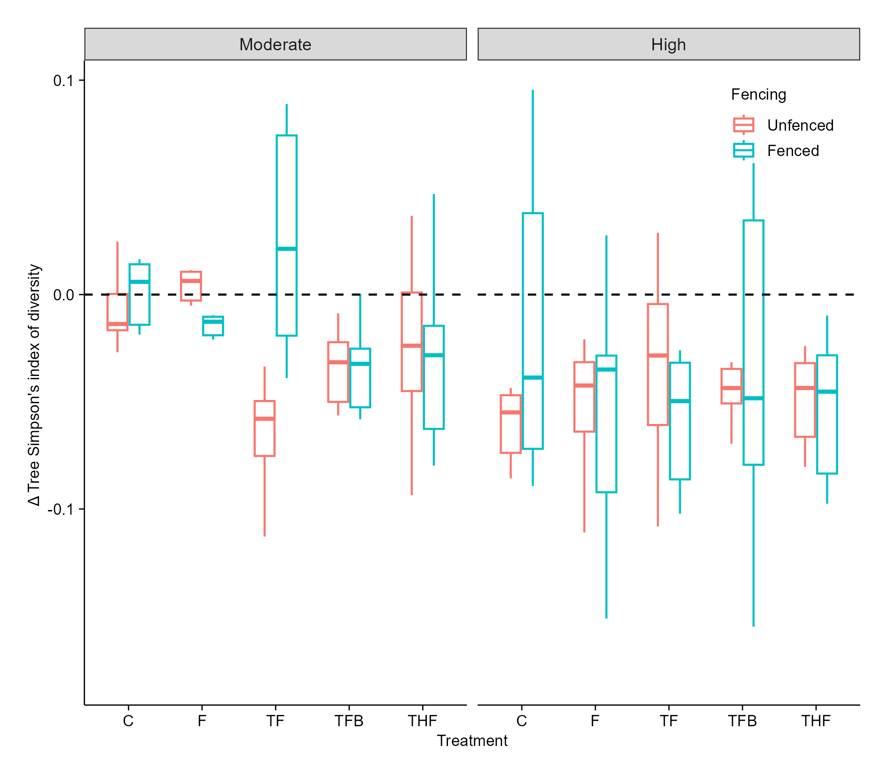
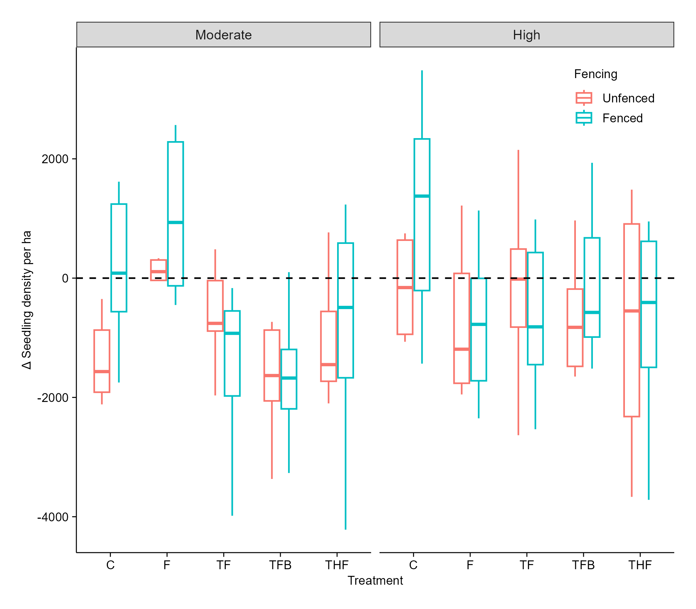
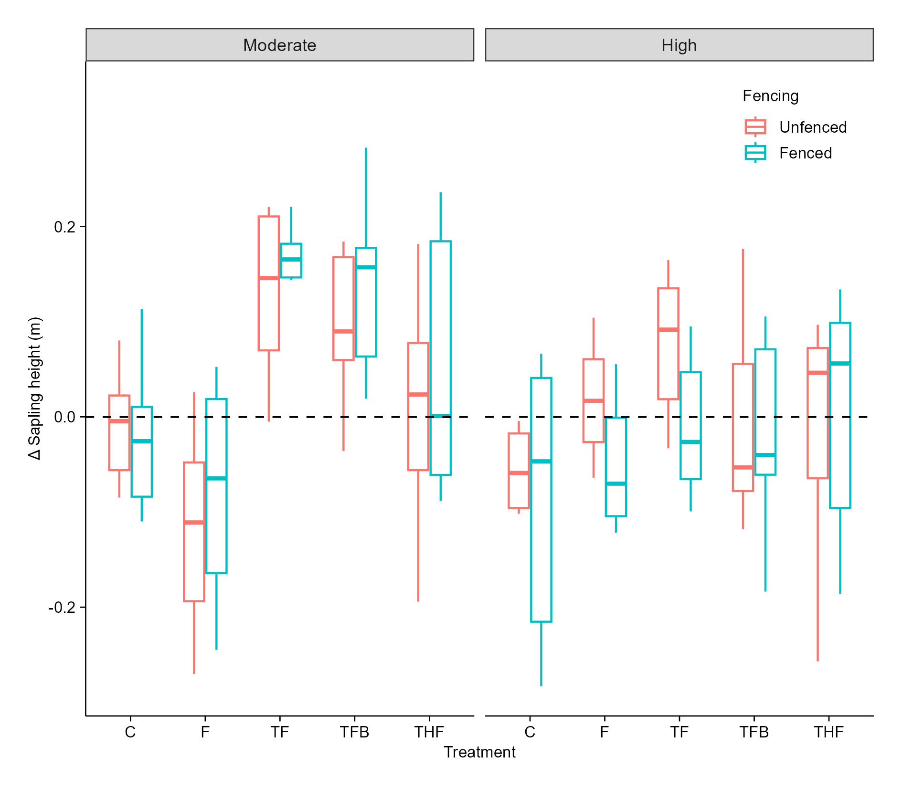
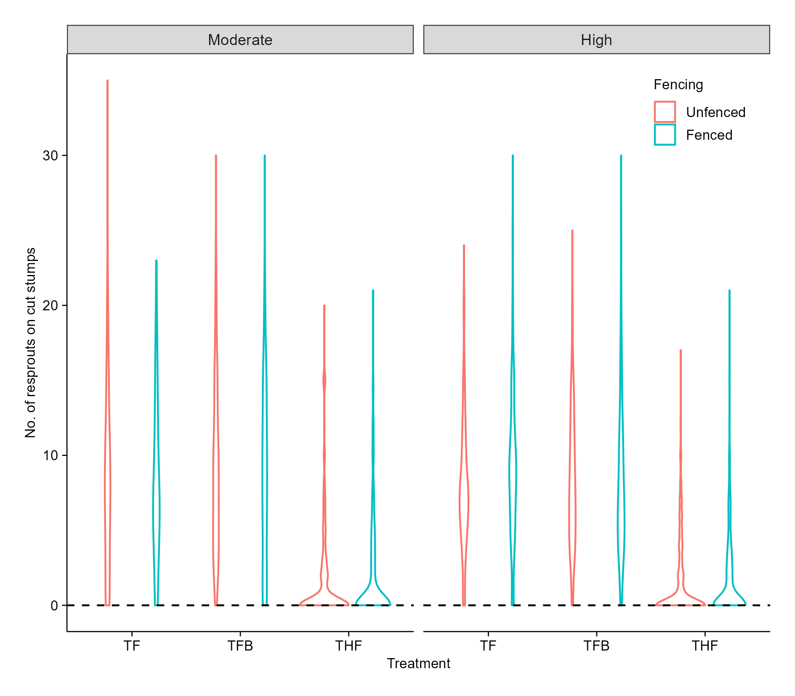
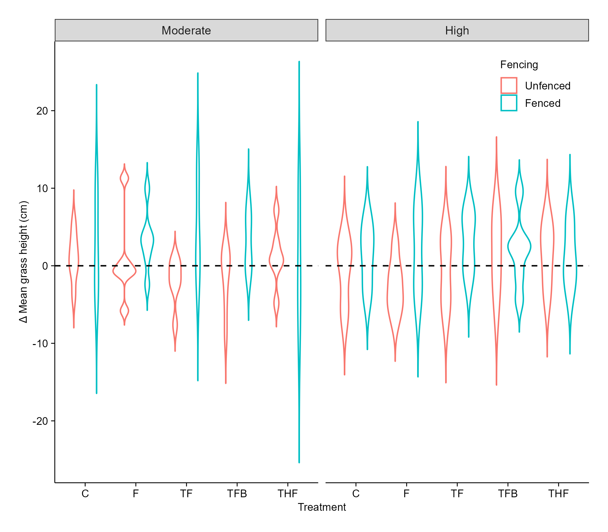
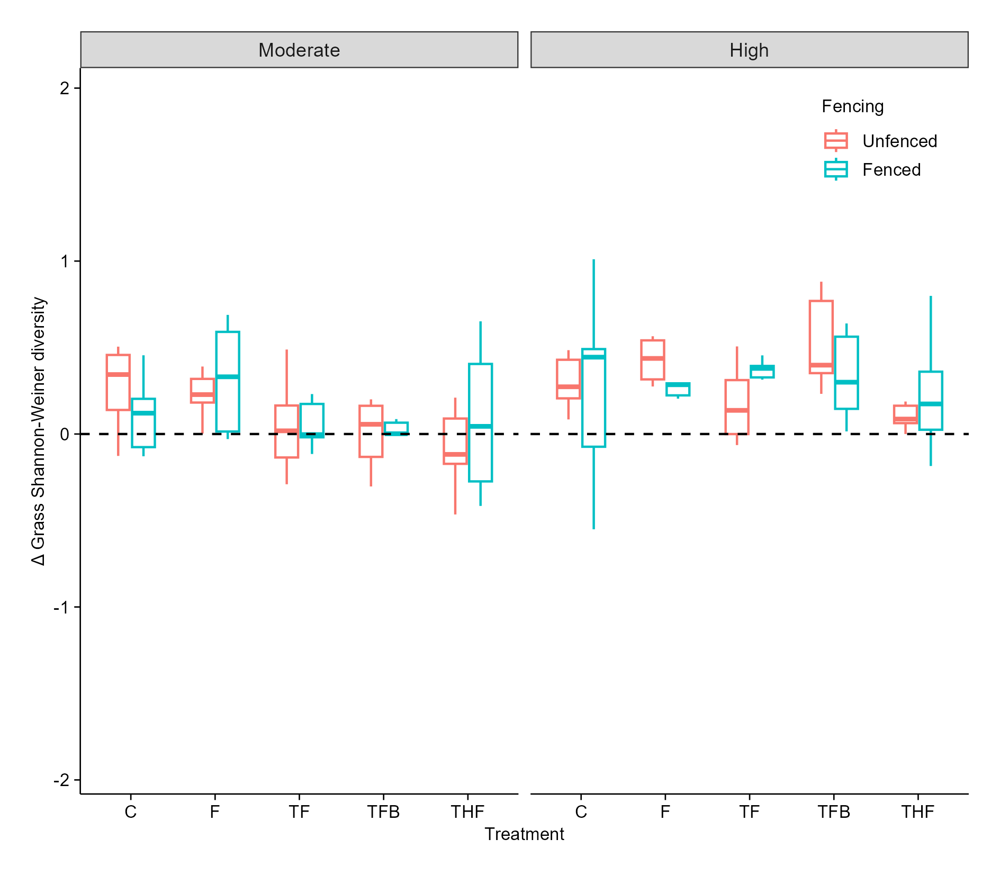
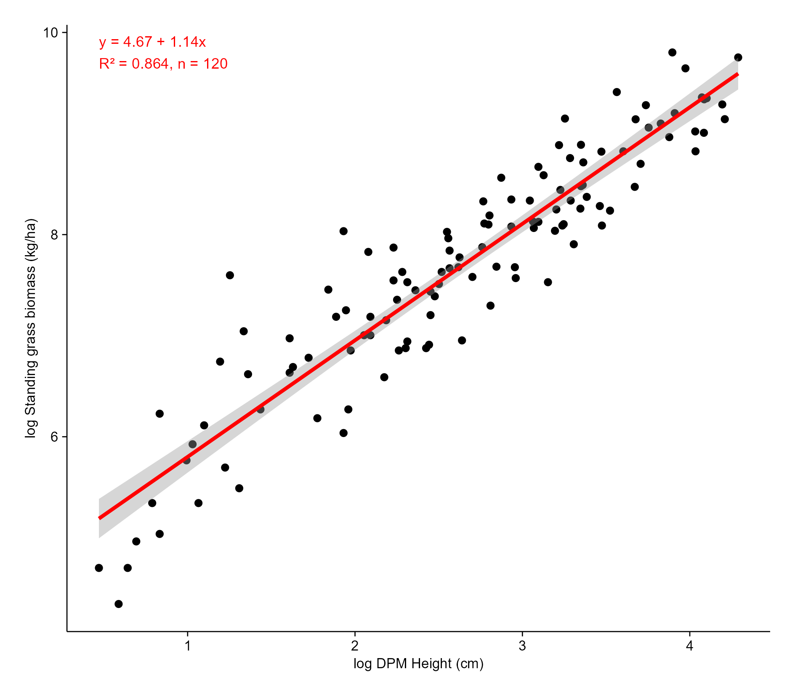

**Title: Managing bush encroachment on a holistically managed rangeland in a semi-arid savanna**

**Research objectives:**   

i\. To determine the efficacy of selected bush encroachment management strategies including woody plant thinning, targeted herbicide application, browsers (goats), and prescribed fire, on seedling density, sapling recruitment, and resprouting dynamics.

ii\. To evaluate the effects of bush encroachment management strategies on above-ground grass biomass, grass species richness, and diversity at encroached sites.

**Hypothesis**

1.  Targeted treatment combinations, such as tree thinning, prescribed fire, and browsing in unfenced plots will significantly decrease seedling density and sapling height in areas with moderate encroachment.
2.  Integrating tree thinning, targeted herbicide application, and prescribed fire will significantly reduce the number of resprouts on cut woody stumps in unfenced and moderately encroached areas.
3.  The above-ground grass biomass will increase across all treatments where tree thinning is done  (due to increased light penetration and water availability (Ludwig et al., 2004) compared to fire-only treatments. undefined

# Agenda for the meeting (01-08-2025)

-   Preliminary results

1.  Tree Simspon's index of Diversity

    {width="595"}

    Figure 1. Tree Simpson's index of Diversity did not change across treatments at SHR five months post-treatment.

-   There is no statistical evidence to show that treatment had an effect on tree Simpson's index of diversity.

    2.  **Seedling density**

{width="647"}

Figure 2. Effect of treatment, fencing and encroachment level on seedling density at SHR five months post treatment.

-   When compared to control treatment F increases seedling density significantly (1569.45, p = 0.0165).

-   Other treatments (TF, TFB, THF) do not show significant effects (p \> 0.05).

-   TF × fencing significantly decreased seedling density (-2116.56, p = 0.005).

-   Fire in highly encroached areas significantly reduced seedling density (-2315.47, p = 0.002).

    -Fencing generally increases seedling density, but this effect is reduced when combined with TF.

    -Treatment F increases seedling density, but this effect is strongly weakened in highly encroached areas.

3.  **Sapling height**

    {width="609"}

    Figure 3. Sapling height at SHR five months post treatment.

-   TF significantly increases (+0.251, p \< 0.0001) sapling height.

-   TFB significantly increases (+0.179, p = 0.015) sapling height.

<!-- -->

-   Treatment and interactions had no effect on sapling height

**Resprouts on cut stumps**

{width="616"}

Figure 4. Effect of treatment, fencing and encroachment level on number of resprout on cut stumps at SHR five months post-treatment.

-   THF significantly reduces (p \< 0.0001) the number of resprouts on cut stumps.

<!-- -->

-   THF × fencing shows that fencing significantly decreases resprouts on cut stumps (-1.391, p \< 0.05)
-   THF reduces the number of resprouts in moderately and highly encroached areas, and fencing does enhance the effect of THF on resprouts on cut stumps. 

{width="647"}

Figure 5. Mean grass DPM height (cm) at SHR five months post-treatment.

-   There was no significant difference (p \> 0.05) in grass DPM height across treatments.

-   Treatment interactions did not show any statistical evidence of their effect on grass DPM height at SHR.

    {width="600"}

Figure 6. Grass Shannon-Weiner diversity shows no change five months post-treatment at SHR.

-   There was no statistical evidence (p \> 0.05) to show that treament had an effect on grass Shannon-Weiner diversity index.

-   Treatment interactions did not significantly affect grass Shannon-Weiner diversity index.

GRASS BIOMASS

{width="649"}

Figure 7. Above-ground grass biomass is strongly predicted by DPM height (cm) at Shangani Holistic Ranch using robust linear regression with log transformed variables.
