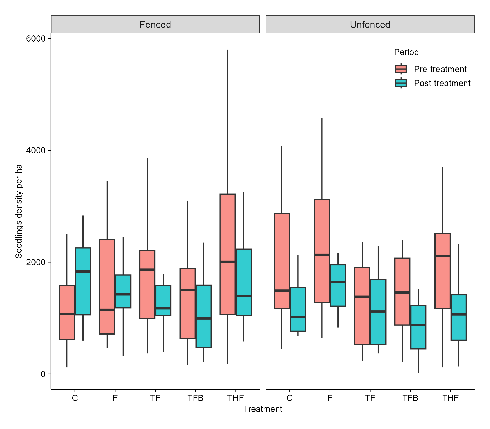
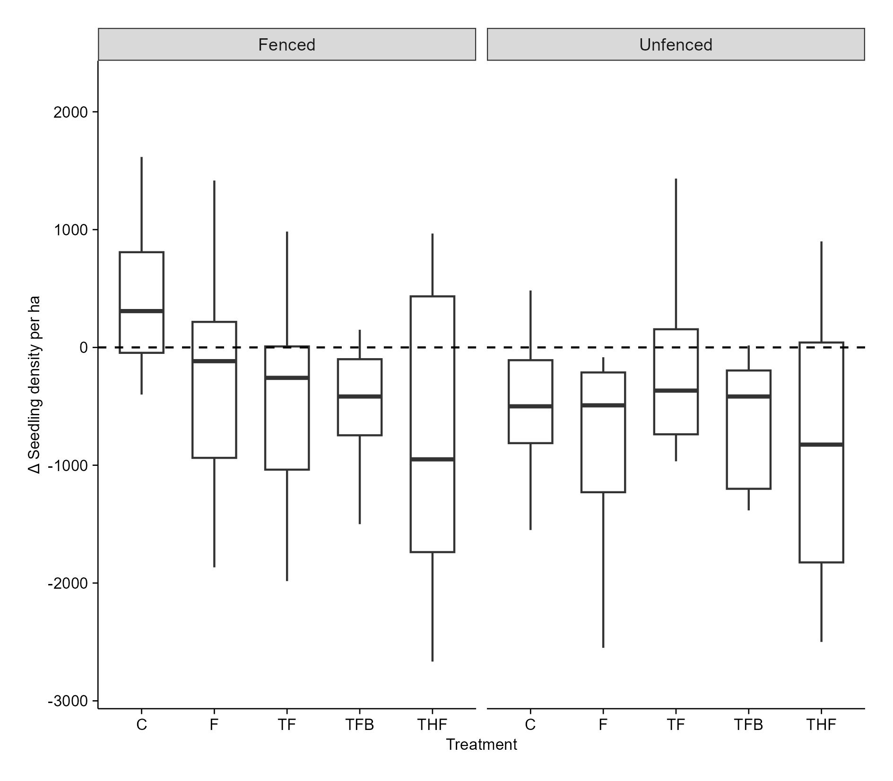
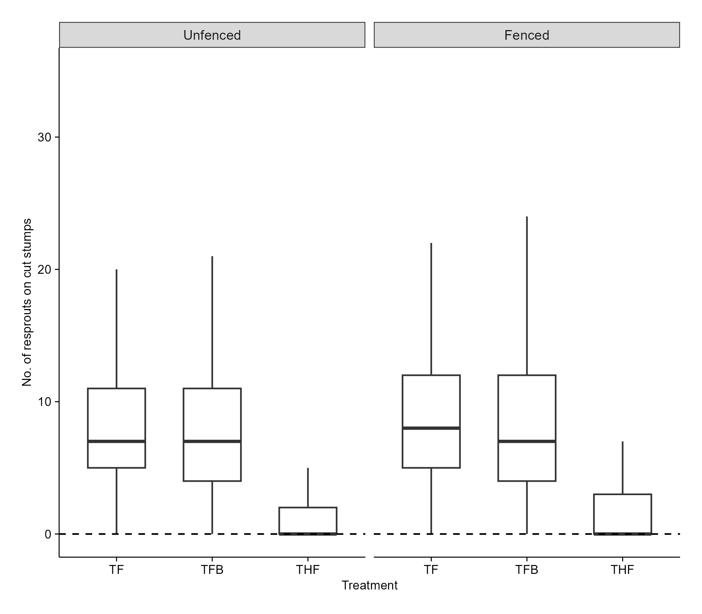
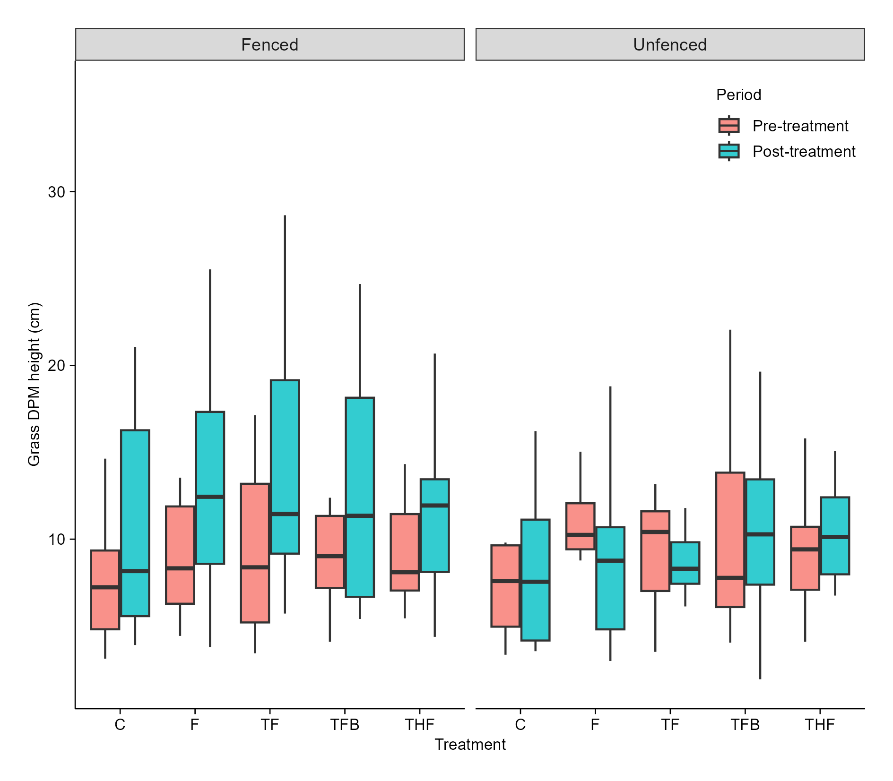
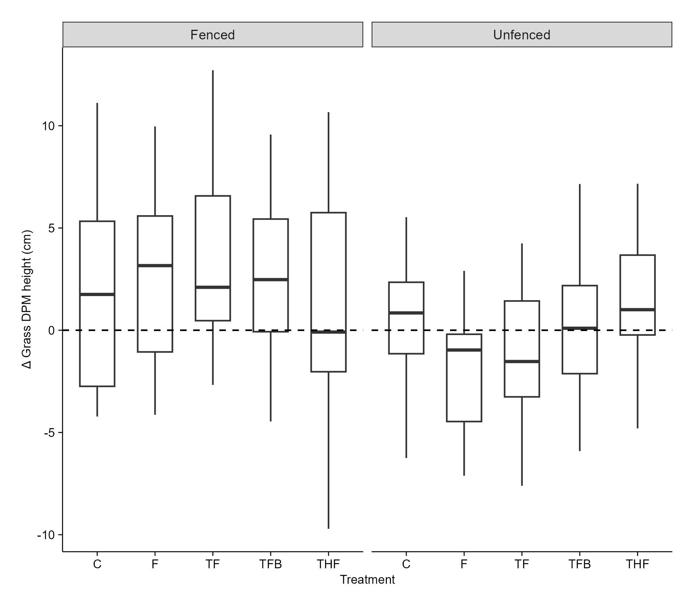
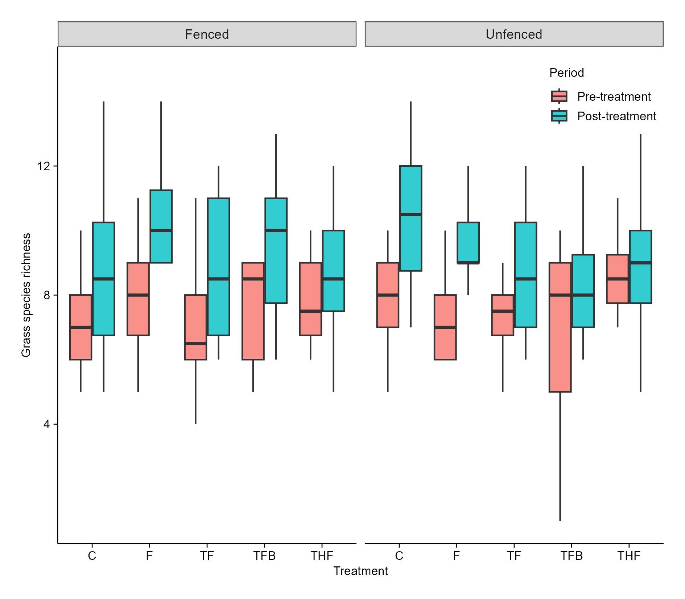
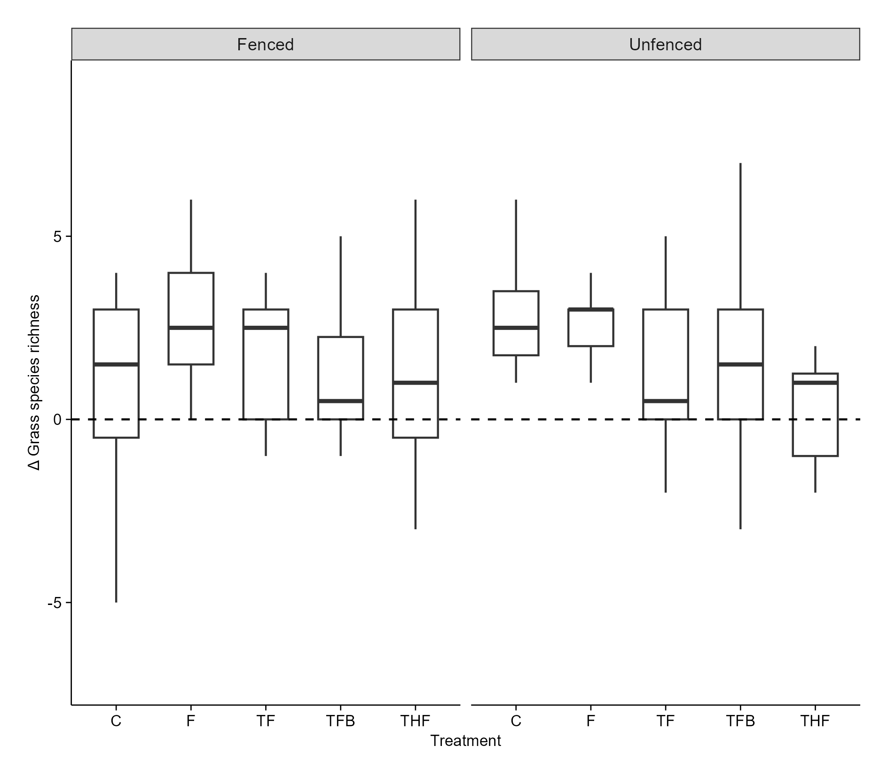
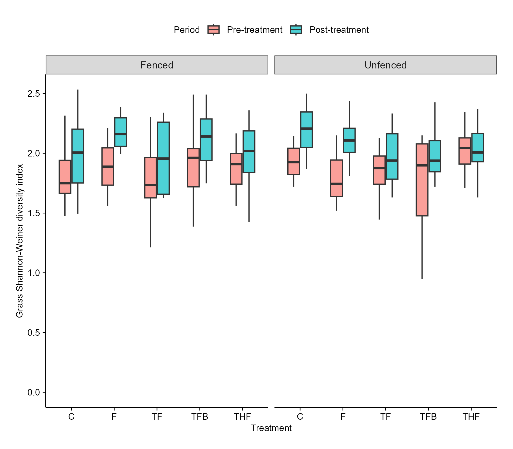
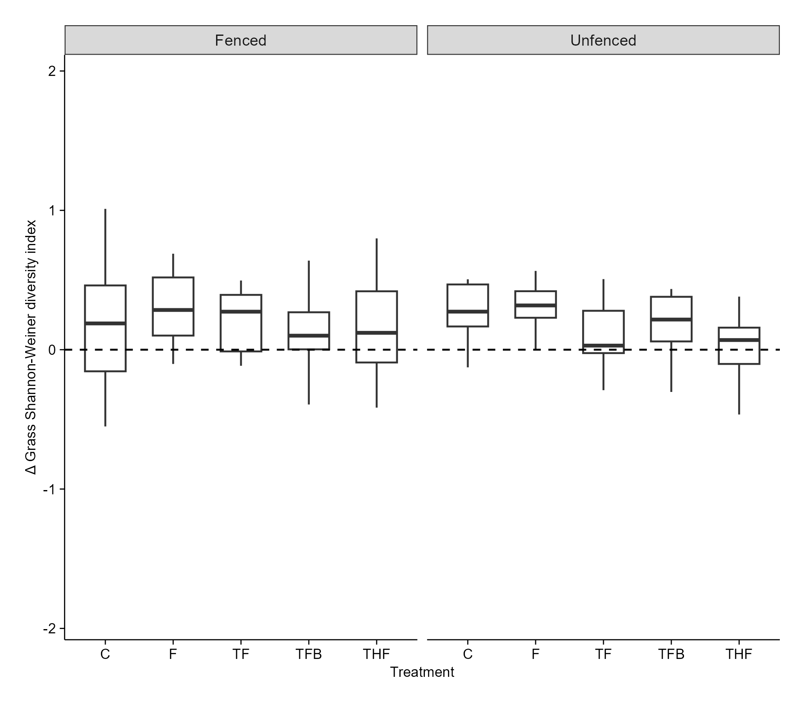

**Title: Managing bush encroachment on a holistically managed rangeland in a semi-arid savanna**

**Research objectives:**   

i\. To determine the efficacy of selected bush encroachment management strategies including woody plant thinning, targeted herbicide application, browsers (goats), and prescribed fire, on seedling density, sapling recruitment, and resprouting dynamics.

ii\. To evaluate the effects of bush encroachment management strategies on above-ground grass biomass, grass species richness, and diversity at encroached sites.

**Hypothesis**

1.  Targeted treatment combinations, such as tree thinning, prescribed fire, and browsing in unfenced plots will significantly decrease seedling density and sapling height.
2.  Integrating tree thinning, targeted herbicide application, and prescribed fire will significantly reduce the number of resprouts on cut woody stumps in unfenced plots.
3.  The above-ground grass biomass will increase across all treatments where tree thinning is done  (due to increased light penetration and water availability (Ludwig et al., 2004).Thinning, herbicide application and prescribe fire will significantly increase above-ground grass biomass in fenced plots.
4.  Grass species richness is expected to increase in treatments where woody plants are thinned, as some grass species may have been excluded from the closed canopies.

# Agenda for the meeting (29-08-2025)

-   Experimental plot burns

-   Preliminary results

    [**Statistical analysis**]{.underline}

    The data was analysed using Generalised Linear Mixed Models (GLMM). For each hypothesis testing, I used the glmmTMB package in R. For most of the tests, I was focusing at the Delta for a specific response variable, hence the Gaussian family was used. An example of the model used for the tests is :

    glmmTMB(Seedlingdensity_ha \~ Treatment \* Fencing + (1 \| Site) + (1\|Plot),  data = seedlings, family = gaussian (link = "identity")).

    The dependent variable is Seedlingdensity_ha. Fixed effects include Treatment and Fencing. The interaction effect of these fixed effects was determined ###explain why you did the interaction. \# write the justification of why we doing the fencing.

    Random effects included Site and Plot. I checked for independence of random effects using the function: table(seedling_trt\$Site, seedling_trt\$Plot). It is not a nested design, as every site (A -F) has all five plots represented. (#To reduce redundancy in the model I dropped Plot, mainly because after testing for random effect variance estimate using VarCorr(my_model), the results, indicated that most of the variability was due to Site differences, and residuals. Plot contributed almost no extra variability once the Site is included). \### include Plot, include sentence in the results section that PLots contributed very little.

    For each test, I checked for model convergence, model performance, normality of residuals, homoscedasticity and Variance Inflated Factors (VIF).

    a\. To check model convergence, I used: **performance::check_convergence(my_model)** where convergence was denoted by TRUE

    b\. To check model performance, I used: **performance::check_model(my_model).** #include output of this in the quarto document.

    c\. To check for Normal distribution of residuals, I used the Shapiro-Wilk Test.  **shapiro.test(resid(my_model)),** where, p \< 0.05 meant that residuals are non-normal. #Check visually.

    d\. To test for homoscedasticity, I used Levene’s Test for Homoscedasticity as follows:

     **fitted_binned \<- cut(fitted(my_model), breaks = 5) leveneTest(resid(my_model) \~ fitted_binned).** If the result had  p \< 0.05 it meant that there was unequal variance (heteroscedasticity).

    e\. To test for VIF I used the package ‘car’. An example of model that was used for checking .

    **mod \<- lm(seedlingdensity_ha\~ Treatment + Fencing, data = seedling)**

    **v \<- vif(mod) and then I adjusted GVIF using 1/(2\*Df)**

    **v_adj \<- v\[, "GVIF"\]\^(1/(2\*v\[, "Df"\]))**

    **v_adj.**

    The results showed that adjusted GVIFs were both 1, which is the lowest possible value. This means: there is no multicollinearity between Treatment and Fencing in the experimental design.

    Additionally, I also used Chisquare test to check for association

    **chisq.test(table(trt_comparison2\$Treatment, trt_comparison2\$Fencing)).** The results showed a value = 1, meaning there is no association between treatment and fencing

    The Cramer’s V was used to check the strength of association using the following:

    **CramerV(table(trt_comparison2\$Treatment, trt_comparison2\$Fencing))**. The result was 0 meaning there was no association between Treatment and Fencing. #Cramér’s V indicates how strong the association is (0 = none, 1 = perfect association).

    -   Alpha level was set at 0.05.

    1.  [**To test the effects of treatments and fencing on seedling density**]{.underline}

    {width="270"}{width="270"}

Figure 1. Effect of treatment, and fencing on seedling density at SHR five months post treatment.

[Interpretation]{.underline}

-   In unfenced plots, treatments F, TF, TFB, and THF, their main effects were not statistically significant (p \> 0.05).

-   Fencing has a significant effect (p = 0.00931), on seedling density. On Control plots that were seedling density was significantly higher than in unfenced plots. This suggests that, in the absence of follow-up treatment, fencing promotes seedling proliferation.

-   Interaction effect: Treatments F, TFB, and THF in fenced plots did not significantly reduce seedling density (p = 0.369, 0.148 and 0.092, respectively). Although the estimates are negative and large.  I am not confident that the effect is real and not due to random chance.

-   TF on fenced plots significantly (p = 0.0086) reduced seedling density. The large negative coefficient indicates that on fenced plots, TF was very effective at reducing seedling density compared to the control. 

-   TFB on its own (p = 0.706) and when fenced (p = 0.148) did not significantly reduce seedling density. TFB does not appear to be a uniq effective treatment. Its performance was not significantly different from the control, either with or without fencing.

    ##Relative to the controls we see that TFB does not significantly reduce seedling density, irrespective of whether it was fenced (p = 0.148) or unfenced (p = 0.706).

    2.  [**To test the effects of treatments and fencing on resprouts population on cut stumps**]{.underline}

    {width="526"}

Figure 2. Effect of treatment, and fencing on number of resprouts on cut stumps at SHR five months post-treatment.

[Interpretation]{.underline}

-   The number of resprouts for the control group in unfenced plots is significant (p \< 0.001) and positive (7.8237). 

-   THF significantly (p \< 0.001) reduces the number of resprouts, and this effect is consistent regardless of fencing.

-   Fencing alone significantly (p = 0.0191) increases the number of resprouts in control plots.

-   TFB has no significant effect on its own (p = 0.4137) or in combination with fencing (p =  0.1708).

```         
3.  **To test the effects of treatments and fencing on the grass DPM height**
```

{width="317"}

{width="317"}

Figure 3. Mean grass DPM height (cm) at SHR five months post-treatment.

[**Interpretation**]{.underline}

-   On unfenced plots, no treatment had a significant impact (p \> 0.05) on above-ground grass DPM height compared to the control.

-   Interaction terms: The effect of the treatments on grass DPM height did not differ (p \> 0.05) between fenced and unfenced plots. In other words, fencing did not make any treatment more or less effective.

    From the results, generally, none of these treatments causes a significant increase or decrease in Grass DPM height.

4.  **To test the effect of treatment and fencing on grass species richness**

    {width="273"}{width="276"}

Figure 4. Grass species richness at SHR five months post treatment.

**Interpretation**

-   The Control in unfenced plots significantly (p = 0.000434) increased grass species richness compared to other treatments.

-   THF caused a significant (p \< 0.01) and substantial decrease in grass species richness. 

-   Fencing alone or in combination with treatments does not significantly (p \> 0.05) alter grass species richness.

5.  [**To test the effect of treatment and fencing on grass species diversity**]{.underline}

{width="269"}

{width="330"}

Figure 5. Grass Shannon-Weiner diversity index at SHR five months post treatment.

The rlmer was used. GLMM with Gaussian family and log transformation could not be used as their residuals were non-normally distributed.

-   Treatments (C, F, TF, TFB) had no significant effect on grass species diversity .

-   The only clear effect was that THF significantly reduced grass species diversity compared to the control, and this effect was consistent across both fenced and unfenced plots.

-   Fencing did not interact with any treatment to influence the outcome; the outcome was negligible. 
