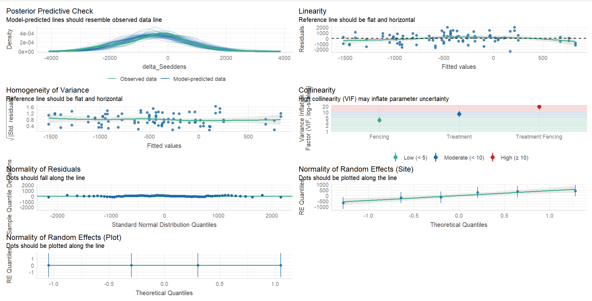
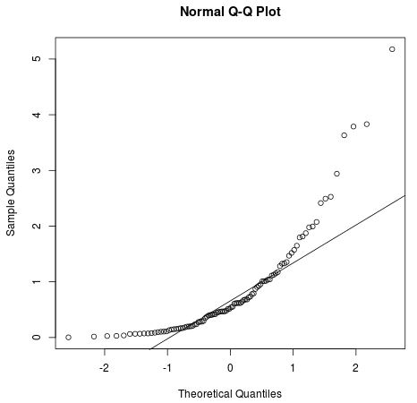
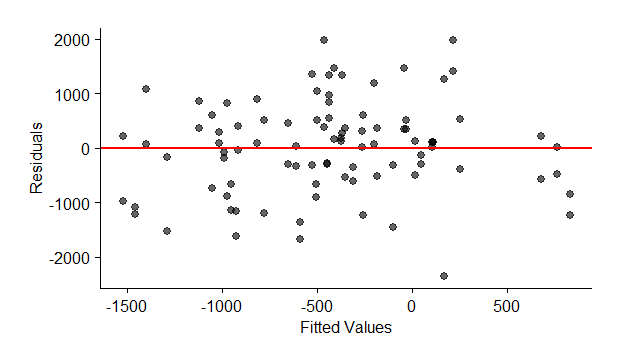

**Title: Managing bush encroachment on a holistically managed rangeland in a semi-arid savanna**

**Research objectives:**   

i\. To determine the efficacy of selected bush encroachment management strategies including woody plant thinning, targeted herbicide application, browsers (goats), and prescribed fire, on seedling density, sapling recruitment, and resprouting dynamics.

ii\. To evaluate the effects of bush encroachment management strategies on above-ground grass biomass, grass species richness, and diversity at encroached sites.

# Why Generalised Linear Mixed Models (GLMMs)?

GLMMs are an extension of:

a.     **Linear Models (LM):** assume normality,while numerous ecological responses, such as presence/absence, counts, and proportions, often exhibit non-normal distributions.

b.     **Generalised Linear Models (GLM):** address non-normality with appropriate distributions (e.g., Poisson, Binomial), however, assumes independent observations.

c.     **Linear Mixed Models (LMM):** account for non-independence with random effects, although assumes a normal distribution for the response variable.

-   GLMMs can account for the hierarchical structure, and data collected across multiple sites or over time.

-   GLMMs can be used to analyse the structure and composition of communities, accounting for the complex interactions between species and environmental factors.

-   GLMMs can cope with complicated data structures like nested data, temporal and spatial correlation, and repeated measurements for all types of data (continuous, binary, proportional, counts, and counts with lots of zeros) (Zuur et al.,2009).

-   GLMMs can incorporate random effects to account for variation in the data that is not explained by fixed effects, such as site-specific or plot-specific variation.

    # **DESIGN CHOICES**

    -   choice of design influenced by by data structure, research question / hypothesis, and knowledge of the system being studied.

        i\. Function and link distribution - does the response variable follow Gaussian, Poisson, Binomial, Negative binomial, Gamma. and their corresponding link.

        ii\. Fixed effects structure - main effects, interactions or polynomial terms?

        iii\. Random effects structure - crossed vs nested design, random slope or random intercept

        # **Data structure**

        str(strt_comparison2)

    ```         
    $ Site      : chr [1:188] "A" "A" "A" "A" ...   
    $ Plot      : num [1:188] 1 1 1 1 1 1 1 1 2 2 ...   
    $ Subplot   : chr [1:188] "Z1" "Z1" "Z2" "Z2" ...   
    $ Treatment : Factor w/ 5 levels "C", "F", "TF", "TFB", "THF"  
    $ Fencing   : Factor w/ 2 levels "Fenced", "Unfenced"   
    $ Year      : num [1:188] 2024 2025 2024 2025 2024 ...  
    $ Seedlings : int [1:188] 44 50 66 119 32 42 100 58 65 83 ...  
    $ density_ha: num [1:188] 733 833 1100 1983 533 ...   
    $ Period    : Factor w/ 2 levels "Pre-treatment","Post-Treatment"
    ```

    Response variable - Change in seedling density

    Fixed effects - Treatment, Fencing

    Random effects - Site, Plot

# GLMMs in use

```{r, warning=FALSE, message=FALSE, fig.cap="Figure 1. Data structure."}

library(tidyverse)
library(vegan)
library(multcompView)
library(patchwork)
library(lmerTest)
library(ggplot2)
library(dplyr)
library(Matrix)
library(lme4)
library(emmeans)
library(here) ## MOST IMPORTANT NOT TO FORGET THIS ONE in quarto
library(robustbase)
library(sjPlot)
library(flextable)
library(officer)
library(glmmTMB)
library(DHARMa)   # model diagnostics GLMM
library(performance)  # model diagnostics
library(car)
library(openxlsx)
library(broom.mixed) #convert model objects to data frames
library(corrplot)
library(robustlmm) # for robust regression analysis
library(boot)  # For bootsrapping
library(DescTools)
library(effectsize)

theme_beautiful <- function() {
  theme_bw() +
    theme(
      text = element_text(family = "Helvetica"),
      axis.text = element_text(size = 8, color = "black"),
      axis.title = element_text(size = 8, color = "black"),
      axis.line.x = element_line(size = 0.3, color = "black"),
      axis.line.y = element_line(size = 0.3, color = "black"),
      axis.ticks = element_line(size = 0.3, color = "black"),
      panel.border = element_blank(),
      panel.grid.major.x = element_blank(),
      panel.grid.minor.x = element_blank(),
      panel.grid.minor.y = element_blank(),
      panel.grid.major.y = element_blank(),
      plot.margin = unit(c(0.5, 0.5, 0.5, 0.5), units = , "cm"),
      plot.title = element_text(
        size = 8,
        vjust = 1,
        hjust = 0.5,
        color = "black"
      ),
      legend.text = element_text(size = 8, color = "black"),
      legend.title = element_text(size = 8, color = "black"),
      legend.position = c(0.9, 0.9),
      legend.key.size = unit(0.9, "line"),
      legend.background = element_rect(
        color = "black",
        fill = "transparent",
        size = 2,
        linetype = "blank"
      )
    )
}

## LOAD DATA

SapF <- read_csv(here("DATA/March2025/WoodyPC3.csv"))

## create seedling, sapling, trees and cut-stump row
SapF <- SapF %>% 
mutate(
woody_cat = case_when(
Woody_class == "Cut stump"          ~ "Cut stump",
between(`Max_height(m)`, 0.05, 0.50)~ "Seedlings",
between(`Max_height(m)`, 0.51, 1.49)~ "Saplings",
between(`Max_height(m)`, 1.5, 21.0) ~ "Trees",
TRUE                             ~ NA_character_
),
Treatment = factor(Treatment),
 Fencing = factor(Fencing)
)

 
#Filter SEEDLINGS  
Seedlings <- SapF %>% 
  filter(woody_cat == "Seedlings", Year %in% c(2024, 2025),
         !Treatment %in% c("TFB")) %>% 
  count(Site, Plot, Subplot, Treatment, Fencing,Year, name = "Seedlings") %>% 
  mutate(density_ha = Seedlings * 10000 / 600)     # convert to ha⁻¹

#comparing at treatment level

Seed_treat <- Seedlings %>% 
  group_by(Site, Plot, Subplot, Treatment, Fencing, Year) %>% 
  summarise(mean_dens_ha = mean(density_ha), .groups = "drop")  


#sort pre and post treatment
strt_comparison2 <- Seedlings %>%
  filter(Year %in% c(2024, 2025)) %>%
  mutate(Period = ifelse(Year == 2024, "Pre-treatment", "Post-treatment"))

#reorder so that pre-treatment appears first then post treatment second on the plots
strt_comparison2 <- strt_comparison2 %>%
  mutate(Period = factor(Period, levels = c("Pre-treatment", "Post-treatment")))

##Pivot the two years side‑by‑side and compute Δ seedling density
Seedlings_Delta <- Seed_treat %>% 
  pivot_wider(names_from  = Year,
              values_from = mean_dens_ha,
              names_glue  = "dens_{Year}") %>% 
  mutate(delta_Seeddens = dens_2025 - dens_2024) 

#GLMM to test effect of treatment * fencing on seedling density###################

# Make "Unfenced" the reference level 

class(Seedlings_Delta$Fencing)  # Likely "character" or "ordered factor"

# Convert to unordered factor explicitly
Seedlings_Delta$Fencing <- factor(Seedlings_Delta$Fencing, ordered = FALSE)

# Verify
levels(Seedlings_Delta$Fencing)  # Should show "Open" "Closed" (or vice versa)

# Set "Unfenced" as the reference level 
Seedlings_Delta$Fencing <- relevel(Seedlings_Delta$Fencing, ref = "Unfenced")


# Site and plot as (crossed) random effects
Seedl3 <- glmmTMB(delta_Seeddens ~ Treatment * Fencing + (1|Site) + (1|Plot),  
                  data = Seedlings_Delta, family = gaussian(link = "identity"))


# check if model converged
#performance::check_convergence(Seedl3) # TRUE the model converged

# MODEL performance
#performance::check_model(Seedl3)

# Shapiro-Wilk Test for Normal distribution of residuals
 #shapiro.test(resid(Seedl3))  #p < 0.05 → residuals are non-normal.
# result p = 0.7431, hence residuals are normal. We have sufficient evidence to conclude that the sample data comes from a population that is normally distributed

## create a Q-Q plot of your residuals: 
 #qqnorm(resid(Seedl3)) 
 #qqline(resid(Seedl3))


##B. Levene’s Test for Homoscedasticity
# Bin fitted values into 3-5 groups
 #fitted_binned <- cut(fitted(Seedl3), breaks = 5)
 #leveneTest(resid(Seedl3) ~ fitted_binned)  # p < 0.05 → unequal variance (heteroscedasticity)
# results p = 0.918 equal variance 

# Assumption on Homoscedasticity

 # check homoscedasticity by creating a fitted value vs. residual plot. The scatterplot should show the fitted values of the model vs. the residuals of those fitted values.

# Line should be flat and horizontal if the homoscedasticity assumption is met.

#Dealing with heteroscedasticity (unequal variance) - log transforming the response variable, weighted regression (assigning weights to each data point based on the variance of its fitted value).

# results of the model
#summary(Seedl3)

```

# GLMM - test efficacy of treatment and fencing on seedling density

Seedl3 \<- glmmTMB(delta_Seeddens \~ Treatment \* Fencing + (1\|Site) + (1\|Plot),\
data = Seedlings_Delta, family = gaussian(link = "identity"))

-   Crossed design because every level of factor (Site) A appears with every level of factor B, C, D, E, F. i.e. all Sites (A - F) receive all treatments (C, F, TF, TFB, THF)

-Before interpreting results from the model it is indispensible to :

\#**check if model converged**

performance::check_convergence(Seedl3) \# TRUE the model converged

\# **check model performance**

performance::check_model(Seedl3)

{width="704"}

# **Assumption 1: Normal distribution**

```{r}
# Shapiro-Wilk Test for Normal distribution of residuals
shapiro.test(resid(Seedl3))  #p < 0.05 → residuals are non-normal.
# result p = 0.7431, hence residuals are normal. We have sufficient evidence to conclude that the sample data comes from a population that is normally distributed

## create a Q-Q plot of your residuals: 
qqnorm(resid(Seedl3)) 
qqline(resid(Seedl3))

```

# 

\- Tests such as Shapiro Wilko, Kolmogorov-Smironov, Jarque-Barre, or D’Agostino-Pearson are sensitive to large sample sizes, they may conclude non-normality of residuals when you have a large sample size.

-   best to visually check your Q-Q plot to ascertain whether a dataset follows a normal distribution



Example of Q-Q plot that shows that the normality of residuals assumptions is not met.

**Dealing with non-normal data**: perform one of the following transformations (log, square root, cube root) to the response variable (y).

# **Assumption 2: Homoscedasticity (equal variance)**

```{r}
##B. Levene’s Test for Homoscedasticity
# Bin fitted values into 3-5 groups
fitted_binned <- cut(fitted(Seedl3), breaks = 5)
leveneTest(resid(Seedl3) ~ fitted_binned)  # p < 0.05 → unequal variance (heteroscedasticity)
# results p = 0.918 equal variance 
```

\- check homoscedasticity by creating a *fitted value vs. residual plot*. The scatterplot should show the fitted values of the model vs. the residuals of those fitted values. The plot should show

-   Data points that are evenly spread out.

-   No clear pattern, such as a curve or a widening/narrowing spread of points. 

-   Line should be flat and horizontal.

    

**Dealing with heteroscedasticity** - log transforming the response variable, weighted regression (assigning weights to each data point based on the variance of its fitted value).

# **Checking for collinearity**

-   Collinearity - occurs when independent variables are highly correlated, making it challenging to isolate and estimate their individual effects.

```{r}
mod1 <- lm(density_ha ~ Treatment + Fencing, data = strt_comparison2)
v <- vif(mod1)

#using adjusted GVIF
# If model has categorical predictors, vif() returns a matrix with GVIF and Df
# adjust GVIF using 1/(2*Df)
v_adj <- v[, "GVIF"]^(1/(2*v[, "Df"]))
v_adj

```

Use of adjusted GVIF shows that both Treatment and Fencing have values of 1 which is the lowest possible value. This means there is no collinearity between Treatment and Fencing in the experimental design. The earlier “high VIF” was just an artifact of how car::vif() reports values for multi-level factors (each dummy looks correlated with the others, but GVIF corrects for this).The earlier high VIF could be due to the dummy-variable trap (redundancy from categorical predictors).

# Preliminary results from the GLMM model

```{r}
# results of the model: change in seedling density  
summary(Seedl3)
```

**Interpretation of Results**

1.  Fencing in control plots resulted in a significant increase in seedling density (p = 0.0158), suggesting a strong association between fencing and seedling proliferation.

2.  TF and fencing were associated with a significant reduction in seedling density (p = 0.0147).

3.  Treatment TF and fencing were highly effective at reducing the seedling proliferation.

4.  The success of these interventions varies significantly between sites, suggesting that site-specific characteristics play a crucial role in determining outcomes.

**Conclusion**

-   GLMMs offer a comprehensive approach that accounts for the inherent complexities of ecological data, yielding more accurate, robust, and broadly applicable insights into ecological systems.

-   Work in progress, more results by June 2026.

**Reading material**

1.  <https://www.annualreviews.org/content/journals/10.1146/annurev.publhealth.23.100901.140546>
2.  <https://link.springer.com/book/10.1007/978-0-387-87458-6>
