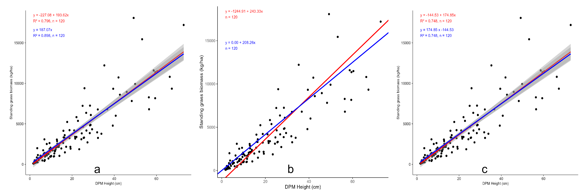
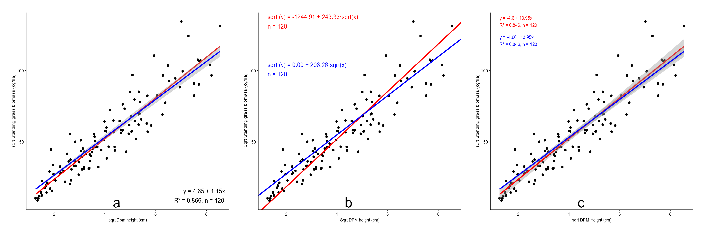
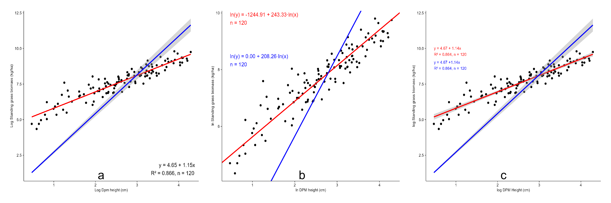

## Introduction

The plots below show the relationship between DPM heights (cm) and standing grass biomass (kg/ha). A comparison of three regression methods OLS, TLS and Robust Linear regression used for developing models, illustrate the linear relationship between DPM height (cm) and standing grass biomass (kg/ha) at SHR.

## Standing grass biomass at SHR

{width="921"}

Figure 1. Comaprison of the three regression approaches used a)OLS, b) TLS, c) Robust Linear regression. They all show a linear relationship. DPM height (cm) is a strong predictor of grass standing biomass (kg/ha) at SHR.

-   The TLS intercept line (blue) shows a slight deviation from the SHR model (red line) when compared to the intercept lines of the OLS and RLM models. This variation occurs because TLS takes into account measurement errors on both axes, leading to a greater drift in its intercept than the OLS model, which assumes errors are present only on the Y-axis.

Figure 2. Square root transformed variables show a linear relationship between Dpm height (cm) and Standing grass biomass from the three regression approaches used: a) OLS, b) TLS, c) Robust linear regression.

-   Square rooted variables show there is a rapid increase in grass standing biomass as DPM height increases.

Figure 3. Log transformed variables show a strong linear relationship between DPM height and standing grass biomass at SHR using three regression approaches; a) OLS, b) TLS, c) RLM .

-   The SHR model (red line) represents a more realistic model of the relationship between log (DPM height (cm)) and log( standing grass biomass (kg/ha)).

-   The red line passes closely through the data points, indicating a reliable model.

-   The blue line (forced intercept) while it passes through origin it may misrepresent the relationship. The OLS and RLM have better slopes compared to the TLS.

-   TLS hard to interpret due to extreme values compared to other two models.

-   TLS is sensitive to scaling hence this could have affected the model.

Generally, plots (a) and (c) show well-fitting, interpretable models that relates DPM height (cm) to grass standing biomass (kg/ha) when we log-transform the variables. The slope measured at 1.14 indicates a strong and positive relationship that is ecologically plausible, especially when compared to plot (b) - TLS.
