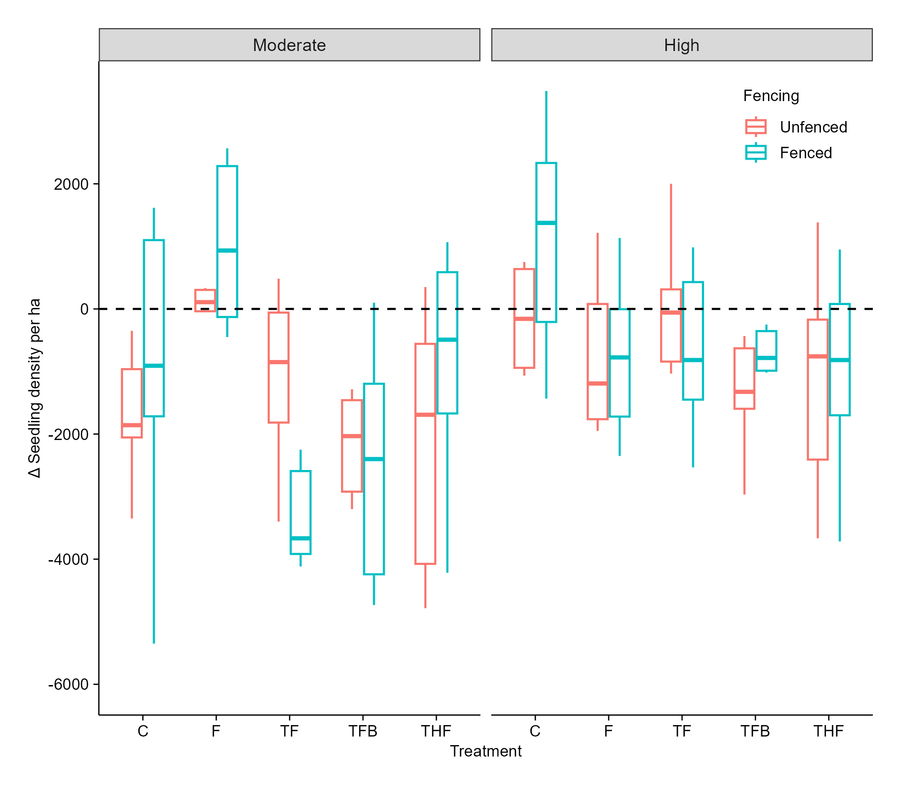

## Introduction

Preliminary results of woody plants and grasses at SHR.

1.  **Seedling density**

{width="594"}

Fig 1. Effect of treatment, fencing and encroachment level on seedling density at SHR five months post treatment.

-   Control: seedling density was significantly lower (- 1744.03, p = 0.006).

-   Treatment F: significantly increased (+2068.84, p = 0.004) seedling density.

-    Other treatments (TF, TFB, THF), did not have an effect (p \>0.05) on seedling density compared to the control.

-    TF in fenced plots significantly reduced (-2134.19, p = 0.009) seedling density.

-   Highly encroached sites had higher seedling density (+1742.92, p = 0.035). 

-   Treatment F significantly (-3133.48, p \< 0.001) reduced seedling density in highly encroached sites.

    -Generally, Treatment TF + fencing may be the best strategy to suppress seedling density

**Resprouts on cut stumps**

{width="616"}

Figure 2. Effect of treatment, fencing and encroachment level on resprout population on cut stumps at SHR five months post treatment.

-   THF significantly reduced resprout population on cut stumps.

Figure 3. Mean grass DPM height (cm) at SHR five months post treatment.

-   There was no significant difference (p \> 0.05) in grass height across treatments.
