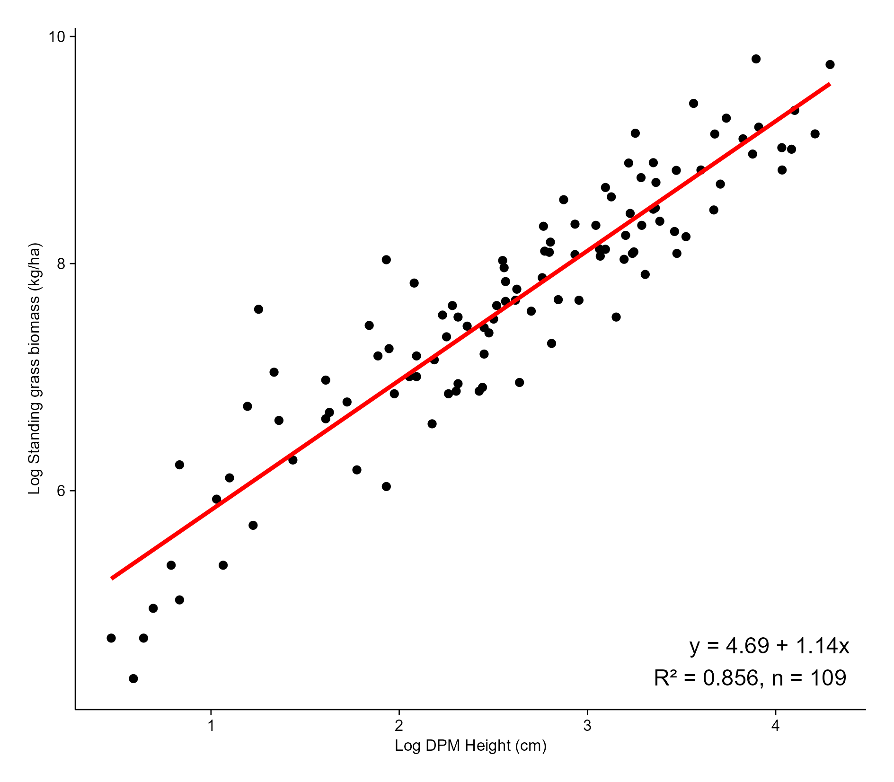
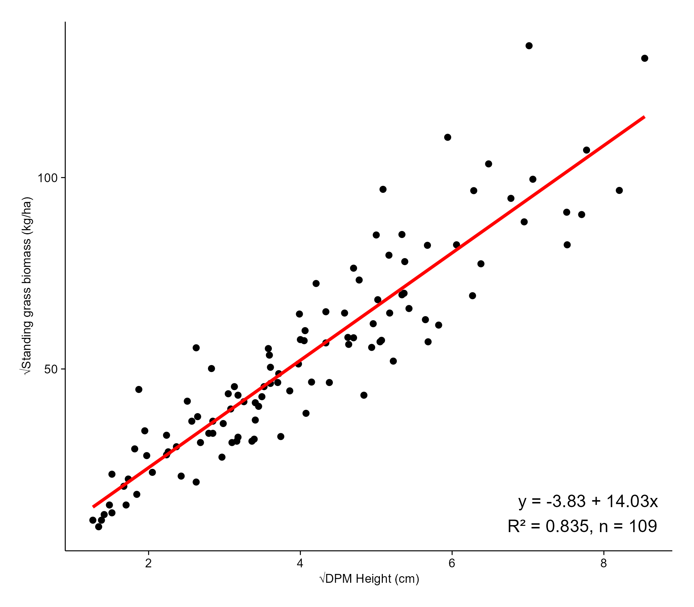

## Introduction

The plots below show the relationship between DPM heights (cm) and standing grass biomass (kg/ha).

## Standing grass biomass at Shangani Holistic Ranch

```{r, warning=FALSE, message=FALSE, fig.cap="Figure 1. Above-ground grass biomass is strongly predicted by DPM height (cm) at Shangani Holistic Ranch. There is a linear relationship"}

library(tidyverse)
library(lmerTest)
library(ggplot2)
library(dplyr)
library(Matrix)
library(lme4)
library(emmeans)
library(here) ## MOST IMPORTANT NOT TO FORGET THIS ONE
library(robustbase)
library(sjPlot)

theme_beautiful <- function() {
  theme_bw() +
    theme(
      text = element_text(family = "Helvetica"),
      axis.text = element_text(size = 8, color = "black"),
      axis.title = element_text(size = 8, color = "black"),
      axis.line.x = element_line(size = 0.3, color = "black"),
      axis.line.y = element_line(size = 0.3, color = "black"),
      axis.ticks = element_line(size = 0.3, color = "black"),
      panel.border = element_blank(),
      panel.grid.major.x = element_blank(),
      panel.grid.minor.x = element_blank(),
      panel.grid.minor.y = element_blank(),
      panel.grid.major.y = element_blank(),
      plot.margin = unit(c(0.5, 0.5, 0.5, 0.5), units = , "cm"),
      plot.title = element_text(
        size = 8,
        vjust = 1,
        hjust = 0.5,
        color = "black"
      ),
      legend.text = element_text(size = 8, color = "black"),
      legend.title = element_text(size = 8, color = "black"),
      legend.position = c(0.9, 0.9),
      legend.key.size = unit(0.9, "line"),
      legend.background = element_rect(
        color = "black",
        fill = "transparent",
        size = 2,
        linetype = "blank"
      )
    )
}

WGdata <- read_csv(here("DATA/DPM.csv"))

################## DPM HEIGHT ~ OVEN DRIED WEIGHT. NO SQUARE ROOT
# 2. Convert weight from grams to kg/ha
#    Area of 34cm diameter disc = π * (0.17 m)^2 = 0.0908 m²
frame_area <- pi * (0.17^2)  # = 0.0908 m²
WGdata$Biomass_kg_ha <- WGdata$Weight * 10 / frame_area

 
 # 3. Linear regression: Biomass ~ DPH
modelWG <- lm(Biomass_kg_ha ~ DPH_Height, data = WGdata)
#summary(modelWG)
# tab_model(modelWG)


 ###adding annotation to the plot
 
 # Extract coefficients
    coefs <- coef(modelWG)
   intercept <- round(coefs[1], 2)
    slope <- round(coefs[2], 2)
 
 # Create equation string for annotation
 # Build the equation string (biomass = intercept + slope * x)
    eq <- paste0("Biomass== ", intercept, " + ", slope, " %*% Dpm")
    
    coef <- coefficients(modelWG)
    r2 <- summary(modelWG)$r.squared
    n <- nobs(modelWG)
    eq <- paste0(
      "y = ", round(coef[1], 2), " + ", round(coef[2], 2), "x\n",
      "R² = ", round(r2, 3), ", n = ", n)
    
 
 # Plot with regression and equation
 
ggplot(WGdata, aes(x = DPH_Height, y = Biomass_kg_ha)) +
  geom_point() +  
  geom_smooth(method = "lm", se = FALSE, color = "red") +
  annotate("text", x = Inf, y = -Inf, label = eq, hjust = 1.1, vjust = -0.5, size = 4, color = "black") +
  labs( x = "Dpm height (cm)",
        y = "Standing grass biomass (kg/ha)"
  ) +
  theme_beautiful()


```

```{r, warning=FALSE, message=FALSE, fig.cap="Figure 2.Comparing SHR model with the fitted intercept line passing through origin"}

library(tidyverse)
library(lmerTest)
library(ggplot2)
library(dplyr)
library(Matrix)
library(lme4)
library(emmeans)
library(here) ## MOST IMPORTANT NOT TO FORGET THIS ONE
library(robustbase)
library(sjPlot)

theme_beautiful <- function() {
  theme_bw() +
    theme(
      text = element_text(family = "Helvetica"),
      axis.text = element_text(size = 8, color = "black"),
      axis.title = element_text(size = 8, color = "black"),
      axis.line.x = element_line(size = 0.3, color = "black"),
      axis.line.y = element_line(size = 0.3, color = "black"),
      axis.ticks = element_line(size = 0.3, color = "black"),
      panel.border = element_blank(),
      panel.grid.major.x = element_blank(),
      panel.grid.minor.x = element_blank(),
      panel.grid.minor.y = element_blank(),
      panel.grid.major.y = element_blank(),
      plot.margin = unit(c(0.5, 0.5, 0.5, 0.5), units = , "cm"),
      plot.title = element_text(
        size = 8,
        vjust = 1,
        hjust = 0.5,
        color = "black"
      ),
      legend.text = element_text(size = 8, color = "black"),
      legend.title = element_text(size = 8, color = "black"),
      legend.position = c(0.9, 0.9),
      legend.key.size = unit(0.9, "line"),
      legend.background = element_rect(
        color = "black",
        fill = "transparent",
        size = 2,
        linetype = "blank"
      )
    )
}

WGdata <- read_csv(here("DATA/DPM.csv"))


################## DPM HEIGHT ~ OVEN DRIED WEIGHT. NO SQUARE ROOT
# 2. Convert weight from grams to kg/ha
#    Area of 34cm diameter disc = π * (0.17 m)^2 = 0.0908 m²
frame_area <- pi * (0.17^2)  # = 0.0908 m²
WGdata$Biomass_kg_ha <- WGdata$Weight * 10 / frame_area


 # 3. Linear regression: Biomass ~ DPH
modelWG <- lm(Biomass_kg_ha ~ DPH_Height, data = WGdata)
#summary(modelWG)
# tab_model(modelWG)

 ###adding annotation to the plot
 
 # Extract coefficients
    coefs <- coef(modelWG)
   intercept <- round(coefs[1], 2)
    slope <- round(coefs[2], 2)
 
 # Create equation string for annotation
 # Build the equation string (biomass = intercept + slope * x)
    eq <- paste0("Biomass== ", intercept, " + ", slope, " %*% Dpm")
    
    coef <- coefficients(modelWG)
    r2 <- summary(modelWG)$r.squared
    n <- nobs(modelWG)
    eq <- paste0(
      "y = ", round(coef[1], 2), " + ", round(coef[2], 2), "x\n",
      "R² = ", round(r2, 3), ", n = ", n)
    
##Using same data to fit INTERCEPT PASSING THROUGH ORIGIN   
    
ggplot(WGdata, aes(x = DPH_Height, y = Biomass_kg_ha))+
     geom_point()+
     geom_smooth(method = "lm", se = TRUE, color = "red")+
     geom_smooth(method="lm", formula = y ~ x - 1, color = "blue")+  ##intercept to pass 0
   annotate("text", x = min(WGdata$DPH_Height, na.rm = TRUE), 
            y = max(WGdata$Biomass_kg_ha, na.rm = TRUE), 
            label = eq, parse = FALSE, hjust = 0, size = 3, color = "red")+
     labs(
       x = "Dpm height (cm)",
       y = "Standing grass biomass (kg/ha)"
     )+
     theme_beautiful()    
  

```




